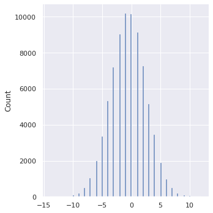
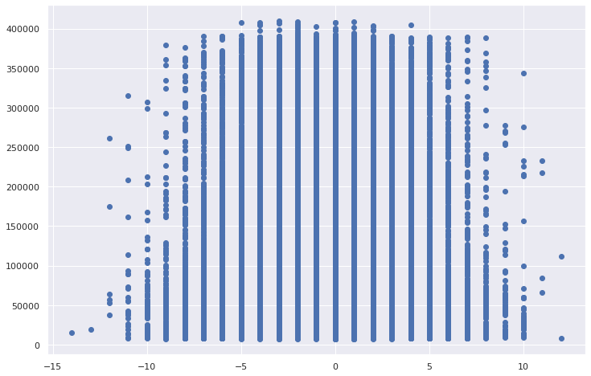
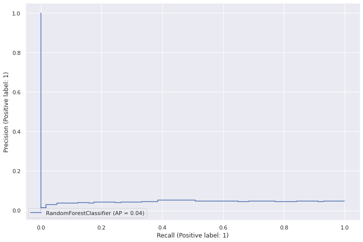
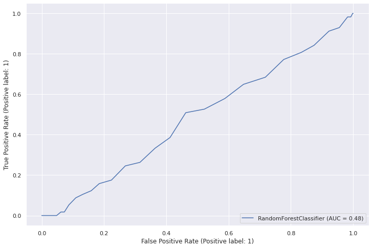
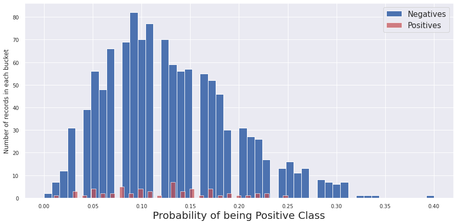
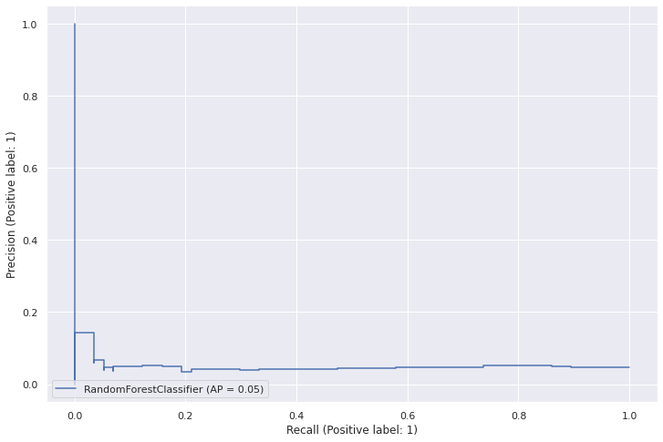
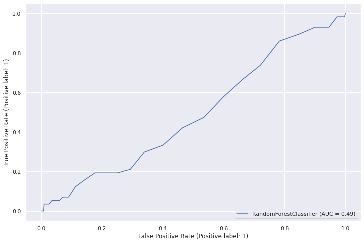
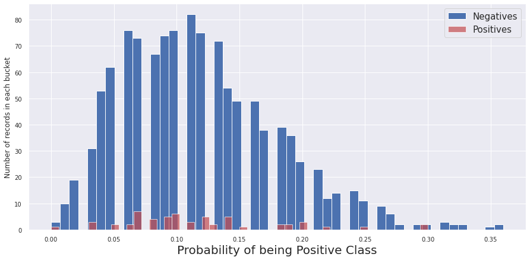

```python
# Install packages not available in the docker image
!pip install psycopg2-binary==2.9.3
```

    Requirement already satisfied: psycopg2-binary==2.9.3 in /opt/conda/lib/python3.9/site-packages (2.9.3)


```python
import os
import pandas as pd
import numpy as np

import matplotlib.pyplot as plt
import seaborn as sns

from sqlalchemy import create_engine
from sklearn.ensemble import RandomForestClassifier
from sklearn.metrics import classification_report, plot_precision_recall_curve, plot_roc_curve

import warnings
warnings.filterwarnings("ignore")
sns.set(rc={'figure.figsize':(12,8)})
```


```python
# Create connection based on environment variables defined at docker-compose.yml
conn_url = "postgresql+psycopg2://" % (
    os.environ["POSTGRES_USER"],
    os.environ["POSTGRES_PASSWORD"],
    os.environ["POSTGRES_DB"]
)
engine = create_engine(conn_url, isolation_level="AUTOCOMMIT")
```

### Show available datasets


```python
from IPython.display import Markdown, display

dfs = {}
with engine.begin() as connection:
    for tbl in ["buyers", "merchants", "orders_creation", "orders_decision", "orders_payment", "datasets"]:
        df = pd.read_sql(f"SELECT * FROM {tbl}", connection)
        index_col = next(c for c in df if c.endswith("_id"))
        dfs[tbl] = df.set_index(index_col)
        
        display(Markdown(f"**{tbl}**"))
        display(dfs[tbl].head(n=10))
```


**buyers**


<div>
<style scoped>
    .dataframe tbody tr th:only-of-type {
        vertical-align: middle;
    }

    .dataframe tbody tr th {
        vertical-align: top;
    }

    .dataframe thead th {
        text-align: right;
    }
</style>
<table border="1" class="dataframe">
  <thead>
    <tr style="text-align: right;">
      <th></th>
      <th>first_name</th>
      <th>last_name</th>
      <th>email</th>
      <th>created_at</th>
    </tr>
    <tr>
      <th>buyer_id</th>
      <th></th>
      <th></th>
      <th></th>
      <th></th>
    </tr>
  </thead>
  <tbody>
    <tr>
      <th>1</th>
      <td>Felicitas</td>
      <td>Dowerg</td>
      <td>weinhagekarl-heinz@example.org</td>
      <td>2019-01-05 16:03:48.065322</td>
    </tr>
    <tr>
      <th>2</th>
      <td>Hellmuth</td>
      <td>Etzold</td>
      <td>stiffeljohanne@example.net</td>
      <td>2019-01-06 02:18:23.014051</td>
    </tr>
    <tr>
      <th>3</th>
      <td>Dieter</td>
      <td>Scheel</td>
      <td>bbeckmann@example.org</td>
      <td>2019-01-06 18:14:18.912525</td>
    </tr>
    <tr>
      <th>4</th>
      <td>Heinz-Jürgen</td>
      <td>Heintze</td>
      <td>rosehans-uwe@example.net</td>
      <td>2019-01-07 23:18:11.857542</td>
    </tr>
    <tr>
      <th>5</th>
      <td>Friedlinde</td>
      <td>Trapp</td>
      <td>chartmann@example.net</td>
      <td>2019-01-08 10:44:52.550876</td>
    </tr>
    <tr>
      <th>6</th>
      <td>Karl-Hans</td>
      <td>Albers</td>
      <td>hildaloeffler@example.com</td>
      <td>2019-01-08 17:48:44.117045</td>
    </tr>
    <tr>
      <th>7</th>
      <td>Karl-Hans</td>
      <td>Förster</td>
      <td>vanessawilms@example.com</td>
      <td>2019-01-10 16:08:24.980765</td>
    </tr>
    <tr>
      <th>8</th>
      <td>Edmund</td>
      <td>Davids</td>
      <td>wdietz@example.com</td>
      <td>2019-01-12 15:39:50.044459</td>
    </tr>
    <tr>
      <th>9</th>
      <td>Dörte</td>
      <td>Hettner</td>
      <td>wagnervalerij@example.net</td>
      <td>2019-01-13 09:43:09.301140</td>
    </tr>
    <tr>
      <th>10</th>
      <td>Faruk</td>
      <td>Kostolzin</td>
      <td>roehrdanzklaus-michael@example.net</td>
      <td>2019-01-13 21:40:06.053150</td>
    </tr>
  </tbody>
</table>
</div>


**merchants**


<div>
<style scoped>
    .dataframe tbody tr th:only-of-type {
        vertical-align: middle;
    }

    .dataframe tbody tr th {
        vertical-align: top;
    }

    .dataframe thead th {
        text-align: right;
    }
</style>
<table border="1" class="dataframe">
  <thead>
    <tr style="text-align: right;">
      <th></th>
      <th>name</th>
      <th>created_at</th>
    </tr>
    <tr>
      <th>merchant_id</th>
      <th></th>
      <th></th>
    </tr>
  </thead>
  <tbody>
    <tr>
      <th>1</th>
      <td>Dowerg</td>
      <td>2019-01-01 18:36:21.374000</td>
    </tr>
    <tr>
      <th>2</th>
      <td>Weinhage GbR</td>
      <td>2019-01-30 18:17:05.389742</td>
    </tr>
    <tr>
      <th>3</th>
      <td>Hauffer AG &amp; Co. KG</td>
      <td>2019-03-08 06:13:25.480632</td>
    </tr>
    <tr>
      <th>4</th>
      <td>Dobes</td>
      <td>2019-03-10 12:02:26.723510</td>
    </tr>
    <tr>
      <th>5</th>
      <td>Weinhage</td>
      <td>2019-03-15 18:53:56.577648</td>
    </tr>
    <tr>
      <th>6</th>
      <td>Christoph</td>
      <td>2019-04-11 11:14:38.032554</td>
    </tr>
    <tr>
      <th>7</th>
      <td>Löffler</td>
      <td>2019-04-23 09:05:19.099020</td>
    </tr>
    <tr>
      <th>8</th>
      <td>Becker AG</td>
      <td>2019-04-24 14:47:02.835260</td>
    </tr>
    <tr>
      <th>9</th>
      <td>Heintze GmbH &amp; Co. OHG</td>
      <td>2019-06-23 06:27:02.565517</td>
    </tr>
    <tr>
      <th>10</th>
      <td>Bauer</td>
      <td>2019-07-27 21:52:33.768389</td>
    </tr>
  </tbody>
</table>
</div>


**orders_creation**


<div>
<style scoped>
    .dataframe tbody tr th:only-of-type {
        vertical-align: middle;
    }

    .dataframe tbody tr th {
        vertical-align: top;
    }

    .dataframe thead th {
        text-align: right;
    }
</style>
<table border="1" class="dataframe">
  <thead>
    <tr style="text-align: right;">
      <th></th>
      <th>buyer_id</th>
      <th>merchant_id</th>
      <th>total_price_cents</th>
      <th>created_at</th>
    </tr>
    <tr>
      <th>order_id</th>
      <th></th>
      <th></th>
      <th></th>
      <th></th>
    </tr>
  </thead>
  <tbody>
    <tr>
      <th>1</th>
      <td>1</td>
      <td>1</td>
      <td>36995</td>
      <td>2019-01-05 16:03:48.065322</td>
    </tr>
    <tr>
      <th>2</th>
      <td>2</td>
      <td>1</td>
      <td>46197</td>
      <td>2019-01-06 02:18:23.014051</td>
    </tr>
    <tr>
      <th>3</th>
      <td>3</td>
      <td>1</td>
      <td>37392</td>
      <td>2019-01-06 18:14:18.912525</td>
    </tr>
    <tr>
      <th>4</th>
      <td>4</td>
      <td>1</td>
      <td>34974</td>
      <td>2019-01-07 23:18:11.857542</td>
    </tr>
    <tr>
      <th>5</th>
      <td>5</td>
      <td>1</td>
      <td>41176</td>
      <td>2019-01-08 10:44:52.550876</td>
    </tr>
    <tr>
      <th>6</th>
      <td>6</td>
      <td>1</td>
      <td>31138</td>
      <td>2019-01-08 17:48:44.117045</td>
    </tr>
    <tr>
      <th>7</th>
      <td>5</td>
      <td>1</td>
      <td>44352</td>
      <td>2019-01-09 00:17:37.327339</td>
    </tr>
    <tr>
      <th>8</th>
      <td>7</td>
      <td>1</td>
      <td>35963</td>
      <td>2019-01-10 16:08:24.980765</td>
    </tr>
    <tr>
      <th>9</th>
      <td>6</td>
      <td>1</td>
      <td>52109</td>
      <td>2019-01-10 17:15:11.111957</td>
    </tr>
    <tr>
      <th>10</th>
      <td>6</td>
      <td>1</td>
      <td>31782</td>
      <td>2019-01-10 23:25:57.600129</td>
    </tr>
  </tbody>
</table>
</div>


**orders_decision**


<div>
<style scoped>
    .dataframe tbody tr th:only-of-type {
        vertical-align: middle;
    }

    .dataframe tbody tr th {
        vertical-align: top;
    }

    .dataframe thead th {
        text-align: right;
    }
</style>
<table border="1" class="dataframe">
  <thead>
    <tr style="text-align: right;">
      <th></th>
      <th>decision</th>
      <th>due_date</th>
      <th>created_at</th>
    </tr>
    <tr>
      <th>order_id</th>
      <th></th>
      <th></th>
      <th></th>
    </tr>
  </thead>
  <tbody>
    <tr>
      <th>1</th>
      <td>ACCEPT</td>
      <td>2019-02-04 16:03:48.248094</td>
      <td>2019-01-05 16:03:48.248094</td>
    </tr>
    <tr>
      <th>2</th>
      <td>ACCEPT</td>
      <td>2019-02-05 02:18:23.093798</td>
      <td>2019-01-06 02:18:23.093798</td>
    </tr>
    <tr>
      <th>3</th>
      <td>ACCEPT</td>
      <td>2019-02-05 18:14:19.026141</td>
      <td>2019-01-06 18:14:19.026141</td>
    </tr>
    <tr>
      <th>4</th>
      <td>ACCEPT</td>
      <td>2019-02-06 23:18:11.898825</td>
      <td>2019-01-07 23:18:11.898825</td>
    </tr>
    <tr>
      <th>5</th>
      <td>ACCEPT</td>
      <td>2019-02-07 10:44:52.943724</td>
      <td>2019-01-08 10:44:52.943724</td>
    </tr>
    <tr>
      <th>6</th>
      <td>ACCEPT</td>
      <td>2019-02-07 17:48:44.200912</td>
      <td>2019-01-08 17:48:44.200912</td>
    </tr>
    <tr>
      <th>7</th>
      <td>ACCEPT</td>
      <td>2019-02-08 00:17:37.363524</td>
      <td>2019-01-09 00:17:37.363524</td>
    </tr>
    <tr>
      <th>8</th>
      <td>ACCEPT</td>
      <td>2019-02-09 16:08:25.024673</td>
      <td>2019-01-10 16:08:25.024673</td>
    </tr>
    <tr>
      <th>9</th>
      <td>ACCEPT</td>
      <td>2019-02-09 17:15:11.205784</td>
      <td>2019-01-10 17:15:11.205784</td>
    </tr>
    <tr>
      <th>10</th>
      <td>ACCEPT</td>
      <td>2019-02-09 23:25:57.642529</td>
      <td>2019-01-10 23:25:57.642529</td>
    </tr>
  </tbody>
</table>
</div>


**orders_payment**


<div>
<style scoped>
    .dataframe tbody tr th:only-of-type {
        vertical-align: middle;
    }

    .dataframe tbody tr th {
        vertical-align: top;
    }

    .dataframe thead th {
        text-align: right;
    }
</style>
<table border="1" class="dataframe">
  <thead>
    <tr style="text-align: right;">
      <th></th>
      <th>created_at</th>
    </tr>
    <tr>
      <th>order_id</th>
      <th></th>
    </tr>
  </thead>
  <tbody>
    <tr>
      <th>1</th>
      <td>2019-02-10 08:16:48.757377</td>
    </tr>
    <tr>
      <th>2</th>
      <td>2019-02-07 10:43:44.381343</td>
    </tr>
    <tr>
      <th>3</th>
      <td>2019-02-01 04:58:48.207862</td>
    </tr>
    <tr>
      <th>4</th>
      <td>2019-02-07 12:06:58.226781</td>
    </tr>
    <tr>
      <th>5</th>
      <td>2019-02-06 03:41:38.824075</td>
    </tr>
    <tr>
      <th>6</th>
      <td>2019-02-11 02:17:47.622723</td>
    </tr>
    <tr>
      <th>7</th>
      <td>2019-02-07 19:46:51.983749</td>
    </tr>
    <tr>
      <th>8</th>
      <td>2019-02-08 19:50:00.076555</td>
    </tr>
    <tr>
      <th>9</th>
      <td>2019-02-04 17:07:21.860173</td>
    </tr>
    <tr>
      <th>10</th>
      <td>2019-02-11 10:15:28.055798</td>
    </tr>
  </tbody>
</table>
</div>


**datasets**


<div>
<style scoped>
    .dataframe tbody tr th:only-of-type {
        vertical-align: middle;
    }

    .dataframe tbody tr th {
        vertical-align: top;
    }

    .dataframe thead th {
        text-align: right;
    }
</style>
<table border="1" class="dataframe">
  <thead>
    <tr style="text-align: right;">
      <th></th>
      <th>dataset_type</th>
    </tr>
    <tr>
      <th>order_id</th>
      <th></th>
    </tr>
  </thead>
  <tbody>
    <tr>
      <th>1</th>
      <td>train</td>
    </tr>
    <tr>
      <th>2</th>
      <td>train</td>
    </tr>
    <tr>
      <th>3</th>
      <td>train</td>
    </tr>
    <tr>
      <th>4</th>
      <td>train</td>
    </tr>
    <tr>
      <th>5</th>
      <td>train</td>
    </tr>
    <tr>
      <th>6</th>
      <td>train</td>
    </tr>
    <tr>
      <th>7</th>
      <td>train</td>
    </tr>
    <tr>
      <th>8</th>
      <td>train</td>
    </tr>
    <tr>
      <th>9</th>
      <td>train</td>
    </tr>
    <tr>
      <th>10</th>
      <td>train</td>
    </tr>
  </tbody>
</table>
</div>


```python
dfs['orders_creation']
```


<div>
<style scoped>
    .dataframe tbody tr th:only-of-type {
        vertical-align: middle;
    }

    .dataframe tbody tr th {
        vertical-align: top;
    }

    .dataframe thead th {
        text-align: right;
    }
</style>
<table border="1" class="dataframe">
  <thead>
    <tr style="text-align: right;">
      <th></th>
      <th>buyer_id</th>
      <th>merchant_id</th>
      <th>total_price_cents</th>
      <th>created_at</th>
    </tr>
    <tr>
      <th>order_id</th>
      <th></th>
      <th></th>
      <th></th>
      <th></th>
    </tr>
  </thead>
  <tbody>
    <tr>
      <th>1</th>
      <td>1</td>
      <td>1</td>
      <td>36995</td>
      <td>2019-01-05 16:03:48.065322</td>
    </tr>
    <tr>
      <th>2</th>
      <td>2</td>
      <td>1</td>
      <td>46197</td>
      <td>2019-01-06 02:18:23.014051</td>
    </tr>
    <tr>
      <th>3</th>
      <td>3</td>
      <td>1</td>
      <td>37392</td>
      <td>2019-01-06 18:14:18.912525</td>
    </tr>
    <tr>
      <th>4</th>
      <td>4</td>
      <td>1</td>
      <td>34974</td>
      <td>2019-01-07 23:18:11.857542</td>
    </tr>
    <tr>
      <th>5</th>
      <td>5</td>
      <td>1</td>
      <td>41176</td>
      <td>2019-01-08 10:44:52.550876</td>
    </tr>
    <tr>
      <th>...</th>
      <td>...</td>
      <td>...</td>
      <td>...</td>
      <td>...</td>
    </tr>
    <tr>
      <th>80343</th>
      <td>4725</td>
      <td>23</td>
      <td>202679</td>
      <td>2022-02-27 07:58:03.883121</td>
    </tr>
    <tr>
      <th>80344</th>
      <td>6934</td>
      <td>75</td>
      <td>16162</td>
      <td>2022-02-27 19:02:59.164577</td>
    </tr>
    <tr>
      <th>80345</th>
      <td>6648</td>
      <td>41</td>
      <td>20557</td>
      <td>2022-02-27 22:47:24.582462</td>
    </tr>
    <tr>
      <th>80346</th>
      <td>6406</td>
      <td>40</td>
      <td>13269</td>
      <td>2022-02-27 23:15:56.515892</td>
    </tr>
    <tr>
      <th>80347</th>
      <td>7211</td>
      <td>52</td>
      <td>25743</td>
      <td>2022-02-28 12:25:10.379446</td>
    </tr>
  </tbody>
</table>
<p>80347 rows × 4 columns</p>
</div>


```python
df_orders = dfs['orders_creation'].reset_index().merge(dfs['orders_decision'], on='order_id', suffixes=[None,'_decision'])
```


```python
df_orders.head()
```


<div>
<style scoped>
    .dataframe tbody tr th:only-of-type {
        vertical-align: middle;
    }

    .dataframe tbody tr th {
        vertical-align: top;
    }

    .dataframe thead th {
        text-align: right;
    }
</style>
<table border="1" class="dataframe">
  <thead>
    <tr style="text-align: right;">
      <th></th>
      <th>order_id</th>
      <th>buyer_id</th>
      <th>merchant_id</th>
      <th>total_price_cents</th>
      <th>created_at</th>
      <th>decision</th>
      <th>due_date</th>
      <th>created_at_decision</th>
    </tr>
  </thead>
  <tbody>
    <tr>
      <th>0</th>
      <td>1</td>
      <td>1</td>
      <td>1</td>
      <td>36995</td>
      <td>2019-01-05 16:03:48.065322</td>
      <td>ACCEPT</td>
      <td>2019-02-04 16:03:48.248094</td>
      <td>2019-01-05 16:03:48.248094</td>
    </tr>
    <tr>
      <th>1</th>
      <td>2</td>
      <td>2</td>
      <td>1</td>
      <td>46197</td>
      <td>2019-01-06 02:18:23.014051</td>
      <td>ACCEPT</td>
      <td>2019-02-05 02:18:23.093798</td>
      <td>2019-01-06 02:18:23.093798</td>
    </tr>
    <tr>
      <th>2</th>
      <td>3</td>
      <td>3</td>
      <td>1</td>
      <td>37392</td>
      <td>2019-01-06 18:14:18.912525</td>
      <td>ACCEPT</td>
      <td>2019-02-05 18:14:19.026141</td>
      <td>2019-01-06 18:14:19.026141</td>
    </tr>
    <tr>
      <th>3</th>
      <td>4</td>
      <td>4</td>
      <td>1</td>
      <td>34974</td>
      <td>2019-01-07 23:18:11.857542</td>
      <td>ACCEPT</td>
      <td>2019-02-06 23:18:11.898825</td>
      <td>2019-01-07 23:18:11.898825</td>
    </tr>
    <tr>
      <th>4</th>
      <td>5</td>
      <td>5</td>
      <td>1</td>
      <td>41176</td>
      <td>2019-01-08 10:44:52.550876</td>
      <td>ACCEPT</td>
      <td>2019-02-07 10:44:52.943724</td>
      <td>2019-01-08 10:44:52.943724</td>
    </tr>
  </tbody>
</table>
</div>


```python
df = df_orders.merge(dfs["buyers"], on="buyer_id", suffixes=[None,'_buyer'])
```


```python
df.head()
```


<div>
<style scoped>
    .dataframe tbody tr th:only-of-type {
        vertical-align: middle;
    }

    .dataframe tbody tr th {
        vertical-align: top;
    }

    .dataframe thead th {
        text-align: right;
    }
</style>
<table border="1" class="dataframe">
  <thead>
    <tr style="text-align: right;">
      <th></th>
      <th>order_id</th>
      <th>buyer_id</th>
      <th>merchant_id</th>
      <th>total_price_cents</th>
      <th>created_at</th>
      <th>decision</th>
      <th>due_date</th>
      <th>created_at_decision</th>
      <th>first_name</th>
      <th>last_name</th>
      <th>email</th>
      <th>created_at_buyer</th>
    </tr>
  </thead>
  <tbody>
    <tr>
      <th>0</th>
      <td>1</td>
      <td>1</td>
      <td>1</td>
      <td>36995</td>
      <td>2019-01-05 16:03:48.065322</td>
      <td>ACCEPT</td>
      <td>2019-02-04 16:03:48.248094</td>
      <td>2019-01-05 16:03:48.248094</td>
      <td>Felicitas</td>
      <td>Dowerg</td>
      <td>weinhagekarl-heinz@example.org</td>
      <td>2019-01-05 16:03:48.065322</td>
    </tr>
    <tr>
      <th>1</th>
      <td>2</td>
      <td>2</td>
      <td>1</td>
      <td>46197</td>
      <td>2019-01-06 02:18:23.014051</td>
      <td>ACCEPT</td>
      <td>2019-02-05 02:18:23.093798</td>
      <td>2019-01-06 02:18:23.093798</td>
      <td>Hellmuth</td>
      <td>Etzold</td>
      <td>stiffeljohanne@example.net</td>
      <td>2019-01-06 02:18:23.014051</td>
    </tr>
    <tr>
      <th>2</th>
      <td>3</td>
      <td>3</td>
      <td>1</td>
      <td>37392</td>
      <td>2019-01-06 18:14:18.912525</td>
      <td>ACCEPT</td>
      <td>2019-02-05 18:14:19.026141</td>
      <td>2019-01-06 18:14:19.026141</td>
      <td>Dieter</td>
      <td>Scheel</td>
      <td>bbeckmann@example.org</td>
      <td>2019-01-06 18:14:18.912525</td>
    </tr>
    <tr>
      <th>3</th>
      <td>4</td>
      <td>4</td>
      <td>1</td>
      <td>34974</td>
      <td>2019-01-07 23:18:11.857542</td>
      <td>ACCEPT</td>
      <td>2019-02-06 23:18:11.898825</td>
      <td>2019-01-07 23:18:11.898825</td>
      <td>Heinz-Jürgen</td>
      <td>Heintze</td>
      <td>rosehans-uwe@example.net</td>
      <td>2019-01-07 23:18:11.857542</td>
    </tr>
    <tr>
      <th>4</th>
      <td>32</td>
      <td>4</td>
      <td>1</td>
      <td>45097</td>
      <td>2019-01-22 10:02:05.061126</td>
      <td>ACCEPT</td>
      <td>2019-02-21 10:02:05.095421</td>
      <td>2019-01-22 10:02:05.095421</td>
      <td>Heinz-Jürgen</td>
      <td>Heintze</td>
      <td>rosehans-uwe@example.net</td>
      <td>2019-01-07 23:18:11.857542</td>
    </tr>
  </tbody>
</table>
</div>


```python
df.groupby(["buyer_id"])["created_at_buyer"].nunique().value_counts()
```


    1    10000
    Name: created_at_buyer, dtype: int64


```python
df = df.merge(dfs["merchants"], on="merchant_id",  suffixes=[None,'_merchant'])
```


```python
df.head()
```


<div>
<style scoped>
    .dataframe tbody tr th:only-of-type {
        vertical-align: middle;
    }

    .dataframe tbody tr th {
        vertical-align: top;
    }

    .dataframe thead th {
        text-align: right;
    }
</style>
<table border="1" class="dataframe">
  <thead>
    <tr style="text-align: right;">
      <th></th>
      <th>order_id</th>
      <th>buyer_id</th>
      <th>merchant_id</th>
      <th>total_price_cents</th>
      <th>created_at</th>
      <th>decision</th>
      <th>due_date</th>
      <th>created_at_decision</th>
      <th>first_name</th>
      <th>last_name</th>
      <th>email</th>
      <th>created_at_buyer</th>
      <th>name</th>
      <th>created_at_merchant</th>
    </tr>
  </thead>
  <tbody>
    <tr>
      <th>0</th>
      <td>1</td>
      <td>1</td>
      <td>1</td>
      <td>36995</td>
      <td>2019-01-05 16:03:48.065322</td>
      <td>ACCEPT</td>
      <td>2019-02-04 16:03:48.248094</td>
      <td>2019-01-05 16:03:48.248094</td>
      <td>Felicitas</td>
      <td>Dowerg</td>
      <td>weinhagekarl-heinz@example.org</td>
      <td>2019-01-05 16:03:48.065322</td>
      <td>Dowerg</td>
      <td>2019-01-01 18:36:21.374</td>
    </tr>
    <tr>
      <th>1</th>
      <td>2</td>
      <td>2</td>
      <td>1</td>
      <td>46197</td>
      <td>2019-01-06 02:18:23.014051</td>
      <td>ACCEPT</td>
      <td>2019-02-05 02:18:23.093798</td>
      <td>2019-01-06 02:18:23.093798</td>
      <td>Hellmuth</td>
      <td>Etzold</td>
      <td>stiffeljohanne@example.net</td>
      <td>2019-01-06 02:18:23.014051</td>
      <td>Dowerg</td>
      <td>2019-01-01 18:36:21.374</td>
    </tr>
    <tr>
      <th>2</th>
      <td>3</td>
      <td>3</td>
      <td>1</td>
      <td>37392</td>
      <td>2019-01-06 18:14:18.912525</td>
      <td>ACCEPT</td>
      <td>2019-02-05 18:14:19.026141</td>
      <td>2019-01-06 18:14:19.026141</td>
      <td>Dieter</td>
      <td>Scheel</td>
      <td>bbeckmann@example.org</td>
      <td>2019-01-06 18:14:18.912525</td>
      <td>Dowerg</td>
      <td>2019-01-01 18:36:21.374</td>
    </tr>
    <tr>
      <th>3</th>
      <td>4</td>
      <td>4</td>
      <td>1</td>
      <td>34974</td>
      <td>2019-01-07 23:18:11.857542</td>
      <td>ACCEPT</td>
      <td>2019-02-06 23:18:11.898825</td>
      <td>2019-01-07 23:18:11.898825</td>
      <td>Heinz-Jürgen</td>
      <td>Heintze</td>
      <td>rosehans-uwe@example.net</td>
      <td>2019-01-07 23:18:11.857542</td>
      <td>Dowerg</td>
      <td>2019-01-01 18:36:21.374</td>
    </tr>
    <tr>
      <th>4</th>
      <td>32</td>
      <td>4</td>
      <td>1</td>
      <td>45097</td>
      <td>2019-01-22 10:02:05.061126</td>
      <td>ACCEPT</td>
      <td>2019-02-21 10:02:05.095421</td>
      <td>2019-01-22 10:02:05.095421</td>
      <td>Heinz-Jürgen</td>
      <td>Heintze</td>
      <td>rosehans-uwe@example.net</td>
      <td>2019-01-07 23:18:11.857542</td>
      <td>Dowerg</td>
      <td>2019-01-01 18:36:21.374</td>
    </tr>
  </tbody>
</table>
</div>


```python
dfs["orders_payment"].reset_index()
```


<div>
<style scoped>
    .dataframe tbody tr th:only-of-type {
        vertical-align: middle;
    }

    .dataframe tbody tr th {
        vertical-align: top;
    }

    .dataframe thead th {
        text-align: right;
    }
</style>
<table border="1" class="dataframe">
  <thead>
    <tr style="text-align: right;">
      <th></th>
      <th>order_id</th>
      <th>created_at</th>
    </tr>
  </thead>
  <tbody>
    <tr>
      <th>0</th>
      <td>1</td>
      <td>2019-02-10 08:16:48.757377</td>
    </tr>
    <tr>
      <th>1</th>
      <td>2</td>
      <td>2019-02-07 10:43:44.381343</td>
    </tr>
    <tr>
      <th>2</th>
      <td>3</td>
      <td>2019-02-01 04:58:48.207862</td>
    </tr>
    <tr>
      <th>3</th>
      <td>4</td>
      <td>2019-02-07 12:06:58.226781</td>
    </tr>
    <tr>
      <th>4</th>
      <td>5</td>
      <td>2019-02-06 03:41:38.824075</td>
    </tr>
    <tr>
      <th>...</th>
      <td>...</td>
      <td>...</td>
    </tr>
    <tr>
      <th>77576</th>
      <td>80343</td>
      <td>2022-04-05 21:47:48.255842</td>
    </tr>
    <tr>
      <th>77577</th>
      <td>80344</td>
      <td>2022-03-31 16:02:42.905176</td>
    </tr>
    <tr>
      <th>77578</th>
      <td>80345</td>
      <td>2022-03-30 08:20:14.289003</td>
    </tr>
    <tr>
      <th>77579</th>
      <td>80346</td>
      <td>2022-03-29 02:09:20.826259</td>
    </tr>
    <tr>
      <th>77580</th>
      <td>80347</td>
      <td>2022-03-28 22:41:29.549440</td>
    </tr>
  </tbody>
</table>
<p>77581 rows × 2 columns</p>
</div>


```python
df.merge(dfs["orders_payment"].reset_index(), on="order_id",  suffixes=[None,'_payment'], how='outer')
```


<div>
<style scoped>
    .dataframe tbody tr th:only-of-type {
        vertical-align: middle;
    }

    .dataframe tbody tr th {
        vertical-align: top;
    }

    .dataframe thead th {
        text-align: right;
    }
</style>
<table border="1" class="dataframe">
  <thead>
    <tr style="text-align: right;">
      <th></th>
      <th>order_id</th>
      <th>buyer_id</th>
      <th>merchant_id</th>
      <th>total_price_cents</th>
      <th>created_at</th>
      <th>decision</th>
      <th>due_date</th>
      <th>created_at_decision</th>
      <th>first_name</th>
      <th>last_name</th>
      <th>email</th>
      <th>created_at_buyer</th>
      <th>name</th>
      <th>created_at_merchant</th>
      <th>created_at_payment</th>
    </tr>
  </thead>
  <tbody>
    <tr>
      <th>0</th>
      <td>1</td>
      <td>1</td>
      <td>1</td>
      <td>36995</td>
      <td>2019-01-05 16:03:48.065322</td>
      <td>ACCEPT</td>
      <td>2019-02-04 16:03:48.248094</td>
      <td>2019-01-05 16:03:48.248094</td>
      <td>Felicitas</td>
      <td>Dowerg</td>
      <td>weinhagekarl-heinz@example.org</td>
      <td>2019-01-05 16:03:48.065322</td>
      <td>Dowerg</td>
      <td>2019-01-01 18:36:21.374000</td>
      <td>2019-02-10 08:16:48.757377</td>
    </tr>
    <tr>
      <th>1</th>
      <td>2</td>
      <td>2</td>
      <td>1</td>
      <td>46197</td>
      <td>2019-01-06 02:18:23.014051</td>
      <td>ACCEPT</td>
      <td>2019-02-05 02:18:23.093798</td>
      <td>2019-01-06 02:18:23.093798</td>
      <td>Hellmuth</td>
      <td>Etzold</td>
      <td>stiffeljohanne@example.net</td>
      <td>2019-01-06 02:18:23.014051</td>
      <td>Dowerg</td>
      <td>2019-01-01 18:36:21.374000</td>
      <td>2019-02-07 10:43:44.381343</td>
    </tr>
    <tr>
      <th>2</th>
      <td>3</td>
      <td>3</td>
      <td>1</td>
      <td>37392</td>
      <td>2019-01-06 18:14:18.912525</td>
      <td>ACCEPT</td>
      <td>2019-02-05 18:14:19.026141</td>
      <td>2019-01-06 18:14:19.026141</td>
      <td>Dieter</td>
      <td>Scheel</td>
      <td>bbeckmann@example.org</td>
      <td>2019-01-06 18:14:18.912525</td>
      <td>Dowerg</td>
      <td>2019-01-01 18:36:21.374000</td>
      <td>2019-02-01 04:58:48.207862</td>
    </tr>
    <tr>
      <th>3</th>
      <td>4</td>
      <td>4</td>
      <td>1</td>
      <td>34974</td>
      <td>2019-01-07 23:18:11.857542</td>
      <td>ACCEPT</td>
      <td>2019-02-06 23:18:11.898825</td>
      <td>2019-01-07 23:18:11.898825</td>
      <td>Heinz-Jürgen</td>
      <td>Heintze</td>
      <td>rosehans-uwe@example.net</td>
      <td>2019-01-07 23:18:11.857542</td>
      <td>Dowerg</td>
      <td>2019-01-01 18:36:21.374000</td>
      <td>2019-02-07 12:06:58.226781</td>
    </tr>
    <tr>
      <th>4</th>
      <td>32</td>
      <td>4</td>
      <td>1</td>
      <td>45097</td>
      <td>2019-01-22 10:02:05.061126</td>
      <td>ACCEPT</td>
      <td>2019-02-21 10:02:05.095421</td>
      <td>2019-01-22 10:02:05.095421</td>
      <td>Heinz-Jürgen</td>
      <td>Heintze</td>
      <td>rosehans-uwe@example.net</td>
      <td>2019-01-07 23:18:11.857542</td>
      <td>Dowerg</td>
      <td>2019-01-01 18:36:21.374000</td>
      <td>2019-02-26 10:45:24.446596</td>
    </tr>
    <tr>
      <th>...</th>
      <td>...</td>
      <td>...</td>
      <td>...</td>
      <td>...</td>
      <td>...</td>
      <td>...</td>
      <td>...</td>
      <td>...</td>
      <td>...</td>
      <td>...</td>
      <td>...</td>
      <td>...</td>
      <td>...</td>
      <td>...</td>
      <td>...</td>
    </tr>
    <tr>
      <th>80342</th>
      <td>77066</td>
      <td>9790</td>
      <td>95</td>
      <td>95639</td>
      <td>2021-12-17 13:55:45.248033</td>
      <td>ACCEPT</td>
      <td>2022-01-16 13:55:45.505110</td>
      <td>2021-12-17 13:55:45.505110</td>
      <td>Daniel</td>
      <td>Heinz</td>
      <td>elwirajaehn@example.org</td>
      <td>2021-12-17 13:55:45.248033</td>
      <td>Mülichen</td>
      <td>2021-10-28 09:46:55.135219</td>
      <td>2022-01-21 13:02:49.228806</td>
    </tr>
    <tr>
      <th>80343</th>
      <td>77621</td>
      <td>9855</td>
      <td>88</td>
      <td>102636</td>
      <td>2021-12-21 10:19:20.183957</td>
      <td>ACCEPT</td>
      <td>2022-01-20 10:19:20.276381</td>
      <td>2021-12-21 10:19:20.276381</td>
      <td>Ernst-August</td>
      <td>Hendriks</td>
      <td>gumprichfriedhelm@example.net</td>
      <td>2021-12-21 10:19:20.183957</td>
      <td>Boucsein Stiftung &amp; Co. KG</td>
      <td>2021-10-04 13:29:09.728608</td>
      <td>2022-01-21 13:48:50.636718</td>
    </tr>
    <tr>
      <th>80344</th>
      <td>79910</td>
      <td>9855</td>
      <td>88</td>
      <td>152282</td>
      <td>2022-01-13 10:36:40.959912</td>
      <td>ACCEPT</td>
      <td>2022-02-12 10:36:41.007623</td>
      <td>2022-01-13 10:36:41.007623</td>
      <td>Ernst-August</td>
      <td>Hendriks</td>
      <td>gumprichfriedhelm@example.net</td>
      <td>2021-12-21 10:19:20.183957</td>
      <td>Boucsein Stiftung &amp; Co. KG</td>
      <td>2021-10-04 13:29:09.728608</td>
      <td>2022-02-11 20:56:08.606545</td>
    </tr>
    <tr>
      <th>80345</th>
      <td>78811</td>
      <td>9970</td>
      <td>100</td>
      <td>33102</td>
      <td>2021-12-30 00:44:42.990116</td>
      <td>ACCEPT</td>
      <td>2022-01-29 00:44:43.077706</td>
      <td>2021-12-30 00:44:43.077706</td>
      <td>Amelie</td>
      <td>Fröhlich</td>
      <td>muellerluzie@example.org</td>
      <td>2021-12-30 00:44:42.990116</td>
      <td>Bloch</td>
      <td>2021-12-26 09:38:58.983800</td>
      <td>2022-01-26 15:17:46.043839</td>
    </tr>
    <tr>
      <th>80346</th>
      <td>80086</td>
      <td>9970</td>
      <td>100</td>
      <td>31847</td>
      <td>2022-01-21 07:49:54.301959</td>
      <td>ACCEPT</td>
      <td>2022-02-20 07:49:54.462568</td>
      <td>2022-01-21 07:49:54.462568</td>
      <td>Amelie</td>
      <td>Fröhlich</td>
      <td>muellerluzie@example.org</td>
      <td>2021-12-30 00:44:42.990116</td>
      <td>Bloch</td>
      <td>2021-12-26 09:38:58.983800</td>
      <td>2022-02-22 16:37:26.888221</td>
    </tr>
  </tbody>
</table>
<p>80347 rows × 15 columns</p>
</div>


```python
df = df.merge(dfs["orders_payment"].reset_index(), on="order_id",  suffixes=[None,'_payment'], how='outer')
```


```python
df
```


<div>
<style scoped>
    .dataframe tbody tr th:only-of-type {
        vertical-align: middle;
    }

    .dataframe tbody tr th {
        vertical-align: top;
    }

    .dataframe thead th {
        text-align: right;
    }
</style>
<table border="1" class="dataframe">
  <thead>
    <tr style="text-align: right;">
      <th></th>
      <th>order_id</th>
      <th>buyer_id</th>
      <th>merchant_id</th>
      <th>total_price_cents</th>
      <th>created_at</th>
      <th>decision</th>
      <th>due_date</th>
      <th>created_at_decision</th>
      <th>first_name</th>
      <th>last_name</th>
      <th>email</th>
      <th>created_at_buyer</th>
      <th>name</th>
      <th>created_at_merchant</th>
      <th>created_at_payment</th>
    </tr>
  </thead>
  <tbody>
    <tr>
      <th>0</th>
      <td>1</td>
      <td>1</td>
      <td>1</td>
      <td>36995</td>
      <td>2019-01-05 16:03:48.065322</td>
      <td>ACCEPT</td>
      <td>2019-02-04 16:03:48.248094</td>
      <td>2019-01-05 16:03:48.248094</td>
      <td>Felicitas</td>
      <td>Dowerg</td>
      <td>weinhagekarl-heinz@example.org</td>
      <td>2019-01-05 16:03:48.065322</td>
      <td>Dowerg</td>
      <td>2019-01-01 18:36:21.374000</td>
      <td>2019-02-10 08:16:48.757377</td>
    </tr>
    <tr>
      <th>1</th>
      <td>2</td>
      <td>2</td>
      <td>1</td>
      <td>46197</td>
      <td>2019-01-06 02:18:23.014051</td>
      <td>ACCEPT</td>
      <td>2019-02-05 02:18:23.093798</td>
      <td>2019-01-06 02:18:23.093798</td>
      <td>Hellmuth</td>
      <td>Etzold</td>
      <td>stiffeljohanne@example.net</td>
      <td>2019-01-06 02:18:23.014051</td>
      <td>Dowerg</td>
      <td>2019-01-01 18:36:21.374000</td>
      <td>2019-02-07 10:43:44.381343</td>
    </tr>
    <tr>
      <th>2</th>
      <td>3</td>
      <td>3</td>
      <td>1</td>
      <td>37392</td>
      <td>2019-01-06 18:14:18.912525</td>
      <td>ACCEPT</td>
      <td>2019-02-05 18:14:19.026141</td>
      <td>2019-01-06 18:14:19.026141</td>
      <td>Dieter</td>
      <td>Scheel</td>
      <td>bbeckmann@example.org</td>
      <td>2019-01-06 18:14:18.912525</td>
      <td>Dowerg</td>
      <td>2019-01-01 18:36:21.374000</td>
      <td>2019-02-01 04:58:48.207862</td>
    </tr>
    <tr>
      <th>3</th>
      <td>4</td>
      <td>4</td>
      <td>1</td>
      <td>34974</td>
      <td>2019-01-07 23:18:11.857542</td>
      <td>ACCEPT</td>
      <td>2019-02-06 23:18:11.898825</td>
      <td>2019-01-07 23:18:11.898825</td>
      <td>Heinz-Jürgen</td>
      <td>Heintze</td>
      <td>rosehans-uwe@example.net</td>
      <td>2019-01-07 23:18:11.857542</td>
      <td>Dowerg</td>
      <td>2019-01-01 18:36:21.374000</td>
      <td>2019-02-07 12:06:58.226781</td>
    </tr>
    <tr>
      <th>4</th>
      <td>32</td>
      <td>4</td>
      <td>1</td>
      <td>45097</td>
      <td>2019-01-22 10:02:05.061126</td>
      <td>ACCEPT</td>
      <td>2019-02-21 10:02:05.095421</td>
      <td>2019-01-22 10:02:05.095421</td>
      <td>Heinz-Jürgen</td>
      <td>Heintze</td>
      <td>rosehans-uwe@example.net</td>
      <td>2019-01-07 23:18:11.857542</td>
      <td>Dowerg</td>
      <td>2019-01-01 18:36:21.374000</td>
      <td>2019-02-26 10:45:24.446596</td>
    </tr>
    <tr>
      <th>...</th>
      <td>...</td>
      <td>...</td>
      <td>...</td>
      <td>...</td>
      <td>...</td>
      <td>...</td>
      <td>...</td>
      <td>...</td>
      <td>...</td>
      <td>...</td>
      <td>...</td>
      <td>...</td>
      <td>...</td>
      <td>...</td>
      <td>...</td>
    </tr>
    <tr>
      <th>80342</th>
      <td>77066</td>
      <td>9790</td>
      <td>95</td>
      <td>95639</td>
      <td>2021-12-17 13:55:45.248033</td>
      <td>ACCEPT</td>
      <td>2022-01-16 13:55:45.505110</td>
      <td>2021-12-17 13:55:45.505110</td>
      <td>Daniel</td>
      <td>Heinz</td>
      <td>elwirajaehn@example.org</td>
      <td>2021-12-17 13:55:45.248033</td>
      <td>Mülichen</td>
      <td>2021-10-28 09:46:55.135219</td>
      <td>2022-01-21 13:02:49.228806</td>
    </tr>
    <tr>
      <th>80343</th>
      <td>77621</td>
      <td>9855</td>
      <td>88</td>
      <td>102636</td>
      <td>2021-12-21 10:19:20.183957</td>
      <td>ACCEPT</td>
      <td>2022-01-20 10:19:20.276381</td>
      <td>2021-12-21 10:19:20.276381</td>
      <td>Ernst-August</td>
      <td>Hendriks</td>
      <td>gumprichfriedhelm@example.net</td>
      <td>2021-12-21 10:19:20.183957</td>
      <td>Boucsein Stiftung &amp; Co. KG</td>
      <td>2021-10-04 13:29:09.728608</td>
      <td>2022-01-21 13:48:50.636718</td>
    </tr>
    <tr>
      <th>80344</th>
      <td>79910</td>
      <td>9855</td>
      <td>88</td>
      <td>152282</td>
      <td>2022-01-13 10:36:40.959912</td>
      <td>ACCEPT</td>
      <td>2022-02-12 10:36:41.007623</td>
      <td>2022-01-13 10:36:41.007623</td>
      <td>Ernst-August</td>
      <td>Hendriks</td>
      <td>gumprichfriedhelm@example.net</td>
      <td>2021-12-21 10:19:20.183957</td>
      <td>Boucsein Stiftung &amp; Co. KG</td>
      <td>2021-10-04 13:29:09.728608</td>
      <td>2022-02-11 20:56:08.606545</td>
    </tr>
    <tr>
      <th>80345</th>
      <td>78811</td>
      <td>9970</td>
      <td>100</td>
      <td>33102</td>
      <td>2021-12-30 00:44:42.990116</td>
      <td>ACCEPT</td>
      <td>2022-01-29 00:44:43.077706</td>
      <td>2021-12-30 00:44:43.077706</td>
      <td>Amelie</td>
      <td>Fröhlich</td>
      <td>muellerluzie@example.org</td>
      <td>2021-12-30 00:44:42.990116</td>
      <td>Bloch</td>
      <td>2021-12-26 09:38:58.983800</td>
      <td>2022-01-26 15:17:46.043839</td>
    </tr>
    <tr>
      <th>80346</th>
      <td>80086</td>
      <td>9970</td>
      <td>100</td>
      <td>31847</td>
      <td>2022-01-21 07:49:54.301959</td>
      <td>ACCEPT</td>
      <td>2022-02-20 07:49:54.462568</td>
      <td>2022-01-21 07:49:54.462568</td>
      <td>Amelie</td>
      <td>Fröhlich</td>
      <td>muellerluzie@example.org</td>
      <td>2021-12-30 00:44:42.990116</td>
      <td>Bloch</td>
      <td>2021-12-26 09:38:58.983800</td>
      <td>2022-02-22 16:37:26.888221</td>
    </tr>
  </tbody>
</table>
<p>80347 rows × 15 columns</p>
</div>


```python
df[df.order_id==154]
```


<div>
<style scoped>
    .dataframe tbody tr th:only-of-type {
        vertical-align: middle;
    }

    .dataframe tbody tr th {
        vertical-align: top;
    }

    .dataframe thead th {
        text-align: right;
    }
</style>
<table border="1" class="dataframe">
  <thead>
    <tr style="text-align: right;">
      <th></th>
      <th>order_id</th>
      <th>buyer_id</th>
      <th>merchant_id</th>
      <th>total_price_cents</th>
      <th>created_at</th>
      <th>decision</th>
      <th>due_date</th>
      <th>created_at_decision</th>
      <th>first_name</th>
      <th>last_name</th>
      <th>email</th>
      <th>created_at_buyer</th>
      <th>name</th>
      <th>created_at_merchant</th>
      <th>created_at_payment</th>
    </tr>
  </thead>
  <tbody>
    <tr>
      <th>232</th>
      <td>154</td>
      <td>15</td>
      <td>1</td>
      <td>43698</td>
      <td>2019-02-23 02:57:28.040635</td>
      <td>REJECT</td>
      <td>NaT</td>
      <td>2019-02-23 02:57:28.090948</td>
      <td>Antoinette</td>
      <td>Wagner</td>
      <td>gottliebmitschke@example.com</td>
      <td>2019-01-19 07:15:07.407308</td>
      <td>Dowerg</td>
      <td>2019-01-01 18:36:21.374</td>
      <td>NaT</td>
    </tr>
  </tbody>
</table>
</div>


```python
df = df.merge(dfs["datasets"].reset_index(), on="order_id")
```


```python
df[df.order_id==154]
```


<div>
<style scoped>
    .dataframe tbody tr th:only-of-type {
        vertical-align: middle;
    }

    .dataframe tbody tr th {
        vertical-align: top;
    }

    .dataframe thead th {
        text-align: right;
    }
</style>
<table border="1" class="dataframe">
  <thead>
    <tr style="text-align: right;">
      <th></th>
      <th>order_id</th>
      <th>buyer_id</th>
      <th>merchant_id</th>
      <th>total_price_cents</th>
      <th>created_at</th>
      <th>decision</th>
      <th>due_date</th>
      <th>created_at_decision</th>
      <th>first_name</th>
      <th>last_name</th>
      <th>email</th>
      <th>created_at_buyer</th>
      <th>name</th>
      <th>created_at_merchant</th>
      <th>created_at_payment</th>
      <th>dataset_type</th>
    </tr>
  </thead>
  <tbody>
    <tr>
      <th>232</th>
      <td>154</td>
      <td>15</td>
      <td>1</td>
      <td>43698</td>
      <td>2019-02-23 02:57:28.040635</td>
      <td>REJECT</td>
      <td>NaT</td>
      <td>2019-02-23 02:57:28.090948</td>
      <td>Antoinette</td>
      <td>Wagner</td>
      <td>gottliebmitschke@example.com</td>
      <td>2019-01-19 07:15:07.407308</td>
      <td>Dowerg</td>
      <td>2019-01-01 18:36:21.374</td>
      <td>NaT</td>
      <td>train</td>
    </tr>
  </tbody>
</table>
</div>


```python
df.decision.value_counts(normalize=True)
```


    ACCEPT    0.978755
    REJECT    0.021245
    Name: decision, dtype: float64


```python
df = df[df.decision!= "REJECT"].drop(columns=["decision", "created_at_decision"])
```


```python
df.groupby("buyer_id").filter(lambda x: len(x)==10).buyer_id.unique()
```


    array([  60,  736, 4217,  144,  177,  321,  339,  375,  537,  604, 1276,
           4755, 5097, 5455, 5632, 5812, 7544,  230, 1143, 1643, 1687, 3184,
           4592,  353,  584,  682, 1139, 1674, 6925,  354,  475, 3759, 4977,
           7269,  777, 1121, 1130, 1274, 3930, 4290, 4760, 4861, 7069, 7292,
           7532,  987, 1764, 1860, 2211, 2821, 5186, 5800,  947, 1362, 1552,
           1761, 2494, 3072, 3484, 4307, 4484, 4605, 5775, 6284, 1136, 5517,
           1042, 1908, 2084, 2362, 5103, 5182, 7091, 8083, 8677, 9416, 2285,
           4284, 9586, 1401, 2369, 3797, 4391, 6663, 9055, 2068, 2100, 2161,
           4218, 7290, 2289, 4725, 5545, 6502, 7298, 8487, 1969, 3961, 4831,
           7732, 9172, 2258, 4432, 3037, 2458, 5019, 5431, 5641, 6840, 7740,
           2535, 3052, 3768, 5296, 5378, 8270, 8457, 2745, 3352, 5466, 6133,
           6590, 6666, 7256, 7664, 8498, 9146, 2669, 3046, 3069, 4709, 4863,
           5173, 5495, 7080, 7289, 7460, 7476, 8582, 8969, 2788, 4210, 4514,
           4546, 6026, 6122, 8137, 8183, 9235, 5742, 6030, 6493, 3591, 7689,
           7879, 8138, 9239, 4015, 4292, 5364, 5532, 8509, 7293, 7506, 3945,
           3993, 4683, 4939, 5698, 5440, 5716, 6130, 4872, 6422, 7154, 7749,
           8460, 8991, 5422, 6520, 4784, 5515, 5617, 8039, 8235, 8314, 6227,
           5201, 7295, 8206, 8814, 9178, 5772, 8136, 5993, 6252, 8506, 7414,
           7155, 9094, 9164, 7801, 8162, 8718, 9286, 9214])


```python
df[df.buyer_id==375]
```


<div>
<style scoped>
    .dataframe tbody tr th:only-of-type {
        vertical-align: middle;
    }

    .dataframe tbody tr th {
        vertical-align: top;
    }

    .dataframe thead th {
        text-align: right;
    }
</style>
<table border="1" class="dataframe">
  <thead>
    <tr style="text-align: right;">
      <th></th>
      <th>order_id</th>
      <th>buyer_id</th>
      <th>merchant_id</th>
      <th>total_price_cents</th>
      <th>created_at</th>
      <th>due_date</th>
      <th>first_name</th>
      <th>last_name</th>
      <th>email</th>
      <th>created_at_buyer</th>
      <th>name</th>
      <th>created_at_merchant</th>
      <th>created_at_payment</th>
      <th>dataset_type</th>
    </tr>
  </thead>
  <tbody>
    <tr>
      <th>3611</th>
      <td>1264</td>
      <td>375</td>
      <td>3</td>
      <td>43210</td>
      <td>2019-05-29 19:14:39.423371</td>
      <td>2019-06-28 19:14:39.597090</td>
      <td>Evelyne</td>
      <td>Röhrdanz</td>
      <td>fatih49@example.net</td>
      <td>2019-05-29 19:14:39.423371</td>
      <td>Hauffer AG &amp; Co. KG</td>
      <td>2019-03-08 06:13:25.480632</td>
      <td>2019-06-27 16:01:36.470346</td>
      <td>train</td>
    </tr>
    <tr>
      <th>3612</th>
      <td>1300</td>
      <td>375</td>
      <td>3</td>
      <td>51506</td>
      <td>2019-06-01 00:41:55.019492</td>
      <td>2019-07-01 00:41:55.389054</td>
      <td>Evelyne</td>
      <td>Röhrdanz</td>
      <td>fatih49@example.net</td>
      <td>2019-05-29 19:14:39.423371</td>
      <td>Hauffer AG &amp; Co. KG</td>
      <td>2019-03-08 06:13:25.480632</td>
      <td>2019-06-27 13:07:33.652447</td>
      <td>train</td>
    </tr>
    <tr>
      <th>3613</th>
      <td>1384</td>
      <td>375</td>
      <td>3</td>
      <td>45141</td>
      <td>2019-06-06 06:31:15.666058</td>
      <td>2019-07-06 06:31:15.734566</td>
      <td>Evelyne</td>
      <td>Röhrdanz</td>
      <td>fatih49@example.net</td>
      <td>2019-05-29 19:14:39.423371</td>
      <td>Hauffer AG &amp; Co. KG</td>
      <td>2019-03-08 06:13:25.480632</td>
      <td>2019-07-05 20:33:21.946271</td>
      <td>train</td>
    </tr>
    <tr>
      <th>3614</th>
      <td>1440</td>
      <td>375</td>
      <td>3</td>
      <td>44622</td>
      <td>2019-06-09 11:57:12.683107</td>
      <td>2019-07-09 11:57:12.887200</td>
      <td>Evelyne</td>
      <td>Röhrdanz</td>
      <td>fatih49@example.net</td>
      <td>2019-05-29 19:14:39.423371</td>
      <td>Hauffer AG &amp; Co. KG</td>
      <td>2019-03-08 06:13:25.480632</td>
      <td>2019-07-10 18:47:15.624795</td>
      <td>train</td>
    </tr>
    <tr>
      <th>3615</th>
      <td>1513</td>
      <td>375</td>
      <td>3</td>
      <td>41833</td>
      <td>2019-06-12 18:03:54.121526</td>
      <td>2019-07-12 18:03:54.151647</td>
      <td>Evelyne</td>
      <td>Röhrdanz</td>
      <td>fatih49@example.net</td>
      <td>2019-05-29 19:14:39.423371</td>
      <td>Hauffer AG &amp; Co. KG</td>
      <td>2019-03-08 06:13:25.480632</td>
      <td>2019-07-14 17:34:46.612663</td>
      <td>train</td>
    </tr>
    <tr>
      <th>3616</th>
      <td>1682</td>
      <td>375</td>
      <td>3</td>
      <td>63112</td>
      <td>2019-06-20 07:24:09.406070</td>
      <td>2019-07-20 07:24:09.414477</td>
      <td>Evelyne</td>
      <td>Röhrdanz</td>
      <td>fatih49@example.net</td>
      <td>2019-05-29 19:14:39.423371</td>
      <td>Hauffer AG &amp; Co. KG</td>
      <td>2019-03-08 06:13:25.480632</td>
      <td>2019-07-19 21:36:16.819275</td>
      <td>train</td>
    </tr>
    <tr>
      <th>3617</th>
      <td>1823</td>
      <td>375</td>
      <td>3</td>
      <td>75425</td>
      <td>2019-06-26 17:10:09.317990</td>
      <td>2019-07-26 17:10:09.330666</td>
      <td>Evelyne</td>
      <td>Röhrdanz</td>
      <td>fatih49@example.net</td>
      <td>2019-05-29 19:14:39.423371</td>
      <td>Hauffer AG &amp; Co. KG</td>
      <td>2019-03-08 06:13:25.480632</td>
      <td>2019-07-26 11:56:12.343557</td>
      <td>train</td>
    </tr>
    <tr>
      <th>3618</th>
      <td>2026</td>
      <td>375</td>
      <td>3</td>
      <td>61336</td>
      <td>2019-07-05 23:08:14.148086</td>
      <td>2019-08-04 23:08:14.171084</td>
      <td>Evelyne</td>
      <td>Röhrdanz</td>
      <td>fatih49@example.net</td>
      <td>2019-05-29 19:14:39.423371</td>
      <td>Hauffer AG &amp; Co. KG</td>
      <td>2019-03-08 06:13:25.480632</td>
      <td>2019-08-08 10:17:05.928721</td>
      <td>train</td>
    </tr>
    <tr>
      <th>3619</th>
      <td>2148</td>
      <td>375</td>
      <td>3</td>
      <td>71940</td>
      <td>2019-07-10 21:00:41.220998</td>
      <td>2019-08-09 21:00:41.223093</td>
      <td>Evelyne</td>
      <td>Röhrdanz</td>
      <td>fatih49@example.net</td>
      <td>2019-05-29 19:14:39.423371</td>
      <td>Hauffer AG &amp; Co. KG</td>
      <td>2019-03-08 06:13:25.480632</td>
      <td>2019-08-06 04:47:28.082991</td>
      <td>train</td>
    </tr>
    <tr>
      <th>3620</th>
      <td>2164</td>
      <td>375</td>
      <td>3</td>
      <td>47761</td>
      <td>2019-07-11 23:59:02.061964</td>
      <td>2019-08-10 23:59:02.098797</td>
      <td>Evelyne</td>
      <td>Röhrdanz</td>
      <td>fatih49@example.net</td>
      <td>2019-05-29 19:14:39.423371</td>
      <td>Hauffer AG &amp; Co. KG</td>
      <td>2019-03-08 06:13:25.480632</td>
      <td>2019-08-06 00:48:53.024973</td>
      <td>train</td>
    </tr>
  </tbody>
</table>
</div>


```python
df[df.buyer_id == 9214]
```


<div>
<style scoped>
    .dataframe tbody tr th:only-of-type {
        vertical-align: middle;
    }

    .dataframe tbody tr th {
        vertical-align: top;
    }

    .dataframe thead th {
        text-align: right;
    }
</style>
<table border="1" class="dataframe">
  <thead>
    <tr style="text-align: right;">
      <th></th>
      <th>order_id</th>
      <th>buyer_id</th>
      <th>merchant_id</th>
      <th>total_price_cents</th>
      <th>created_at</th>
      <th>due_date</th>
      <th>first_name</th>
      <th>last_name</th>
      <th>email</th>
      <th>created_at_buyer</th>
      <th>name</th>
      <th>created_at_merchant</th>
      <th>created_at_payment</th>
      <th>dataset_type</th>
    </tr>
  </thead>
  <tbody>
    <tr>
      <th>80307</th>
      <td>71607</td>
      <td>9214</td>
      <td>85</td>
      <td>251057</td>
      <td>2021-11-09 22:04:49.932750</td>
      <td>2021-12-09 22:04:49.994654</td>
      <td>Xenia</td>
      <td>Heß</td>
      <td>karinaladeck@example.com</td>
      <td>2021-11-09 22:04:49.932750</td>
      <td>Hecker AG</td>
      <td>2021-08-25 06:13:38.177492</td>
      <td>2021-12-10 20:56:25.015066</td>
      <td>train</td>
    </tr>
    <tr>
      <th>80308</th>
      <td>72188</td>
      <td>9214</td>
      <td>85</td>
      <td>240266</td>
      <td>2021-11-13 21:28:34.699393</td>
      <td>2021-12-13 21:28:34.934809</td>
      <td>Xenia</td>
      <td>Heß</td>
      <td>karinaladeck@example.com</td>
      <td>2021-11-09 22:04:49.932750</td>
      <td>Hecker AG</td>
      <td>2021-08-25 06:13:38.177492</td>
      <td>2021-12-14 03:58:06.889571</td>
      <td>train</td>
    </tr>
    <tr>
      <th>80309</th>
      <td>74743</td>
      <td>9214</td>
      <td>85</td>
      <td>200764</td>
      <td>2021-12-01 02:09:50.217274</td>
      <td>2021-12-31 02:09:50.256507</td>
      <td>Xenia</td>
      <td>Heß</td>
      <td>karinaladeck@example.com</td>
      <td>2021-11-09 22:04:49.932750</td>
      <td>Hecker AG</td>
      <td>2021-08-25 06:13:38.177492</td>
      <td>2021-12-31 17:05:34.412788</td>
      <td>train</td>
    </tr>
    <tr>
      <th>80310</th>
      <td>75147</td>
      <td>9214</td>
      <td>85</td>
      <td>152908</td>
      <td>2021-12-03 22:45:53.599286</td>
      <td>2022-01-02 22:45:53.789525</td>
      <td>Xenia</td>
      <td>Heß</td>
      <td>karinaladeck@example.com</td>
      <td>2021-11-09 22:04:49.932750</td>
      <td>Hecker AG</td>
      <td>2021-08-25 06:13:38.177492</td>
      <td>2022-01-05 06:16:15.641094</td>
      <td>train</td>
    </tr>
    <tr>
      <th>80311</th>
      <td>76781</td>
      <td>9214</td>
      <td>85</td>
      <td>259593</td>
      <td>2021-12-15 08:39:58.268860</td>
      <td>2022-01-14 08:39:58.270670</td>
      <td>Xenia</td>
      <td>Heß</td>
      <td>karinaladeck@example.com</td>
      <td>2021-11-09 22:04:49.932750</td>
      <td>Hecker AG</td>
      <td>2021-08-25 06:13:38.177492</td>
      <td>2022-01-14 19:12:21.218537</td>
      <td>train</td>
    </tr>
    <tr>
      <th>80312</th>
      <td>77997</td>
      <td>9214</td>
      <td>85</td>
      <td>167897</td>
      <td>2021-12-23 22:26:45.546584</td>
      <td>2022-01-22 22:26:45.753808</td>
      <td>Xenia</td>
      <td>Heß</td>
      <td>karinaladeck@example.com</td>
      <td>2021-11-09 22:04:49.932750</td>
      <td>Hecker AG</td>
      <td>2021-08-25 06:13:38.177492</td>
      <td>2022-01-26 16:00:32.832681</td>
      <td>train</td>
    </tr>
    <tr>
      <th>80313</th>
      <td>78001</td>
      <td>9214</td>
      <td>85</td>
      <td>247543</td>
      <td>2021-12-23 23:54:51.190913</td>
      <td>2022-01-22 23:54:51.338691</td>
      <td>Xenia</td>
      <td>Heß</td>
      <td>karinaladeck@example.com</td>
      <td>2021-11-09 22:04:49.932750</td>
      <td>Hecker AG</td>
      <td>2021-08-25 06:13:38.177492</td>
      <td>2022-01-19 09:47:58.219503</td>
      <td>train</td>
    </tr>
    <tr>
      <th>80314</th>
      <td>78249</td>
      <td>9214</td>
      <td>85</td>
      <td>179469</td>
      <td>2021-12-25 21:15:33.441991</td>
      <td>2022-01-24 21:15:33.694572</td>
      <td>Xenia</td>
      <td>Heß</td>
      <td>karinaladeck@example.com</td>
      <td>2021-11-09 22:04:49.932750</td>
      <td>Hecker AG</td>
      <td>2021-08-25 06:13:38.177492</td>
      <td>2022-01-26 11:41:38.965638</td>
      <td>train</td>
    </tr>
    <tr>
      <th>80315</th>
      <td>78727</td>
      <td>9214</td>
      <td>85</td>
      <td>263825</td>
      <td>2021-12-29 09:55:19.181863</td>
      <td>2022-01-28 09:55:19.233362</td>
      <td>Xenia</td>
      <td>Heß</td>
      <td>karinaladeck@example.com</td>
      <td>2021-11-09 22:04:49.932750</td>
      <td>Hecker AG</td>
      <td>2021-08-25 06:13:38.177492</td>
      <td>2022-01-22 16:39:29.405748</td>
      <td>train</td>
    </tr>
    <tr>
      <th>80316</th>
      <td>79365</td>
      <td>9214</td>
      <td>85</td>
      <td>177782</td>
      <td>2022-01-03 17:27:28.659693</td>
      <td>2022-02-02 17:27:28.679237</td>
      <td>Xenia</td>
      <td>Heß</td>
      <td>karinaladeck@example.com</td>
      <td>2021-11-09 22:04:49.932750</td>
      <td>Hecker AG</td>
      <td>2021-08-25 06:13:38.177492</td>
      <td>2022-01-31 06:37:10.273782</td>
      <td>test</td>
    </tr>
  </tbody>
</table>
</div>


```python
df.head()
```


<div>
<style scoped>
    .dataframe tbody tr th:only-of-type {
        vertical-align: middle;
    }

    .dataframe tbody tr th {
        vertical-align: top;
    }

    .dataframe thead th {
        text-align: right;
    }
</style>
<table border="1" class="dataframe">
  <thead>
    <tr style="text-align: right;">
      <th></th>
      <th>order_id</th>
      <th>buyer_id</th>
      <th>merchant_id</th>
      <th>total_price_cents</th>
      <th>created_at</th>
      <th>due_date</th>
      <th>first_name</th>
      <th>last_name</th>
      <th>email</th>
      <th>created_at_buyer</th>
      <th>name</th>
      <th>created_at_merchant</th>
      <th>created_at_payment</th>
      <th>dataset_type</th>
    </tr>
  </thead>
  <tbody>
    <tr>
      <th>0</th>
      <td>1</td>
      <td>1</td>
      <td>1</td>
      <td>36995</td>
      <td>2019-01-05 16:03:48.065322</td>
      <td>2019-02-04 16:03:48.248094</td>
      <td>Felicitas</td>
      <td>Dowerg</td>
      <td>weinhagekarl-heinz@example.org</td>
      <td>2019-01-05 16:03:48.065322</td>
      <td>Dowerg</td>
      <td>2019-01-01 18:36:21.374</td>
      <td>2019-02-10 08:16:48.757377</td>
      <td>train</td>
    </tr>
    <tr>
      <th>1</th>
      <td>2</td>
      <td>2</td>
      <td>1</td>
      <td>46197</td>
      <td>2019-01-06 02:18:23.014051</td>
      <td>2019-02-05 02:18:23.093798</td>
      <td>Hellmuth</td>
      <td>Etzold</td>
      <td>stiffeljohanne@example.net</td>
      <td>2019-01-06 02:18:23.014051</td>
      <td>Dowerg</td>
      <td>2019-01-01 18:36:21.374</td>
      <td>2019-02-07 10:43:44.381343</td>
      <td>train</td>
    </tr>
    <tr>
      <th>2</th>
      <td>3</td>
      <td>3</td>
      <td>1</td>
      <td>37392</td>
      <td>2019-01-06 18:14:18.912525</td>
      <td>2019-02-05 18:14:19.026141</td>
      <td>Dieter</td>
      <td>Scheel</td>
      <td>bbeckmann@example.org</td>
      <td>2019-01-06 18:14:18.912525</td>
      <td>Dowerg</td>
      <td>2019-01-01 18:36:21.374</td>
      <td>2019-02-01 04:58:48.207862</td>
      <td>train</td>
    </tr>
    <tr>
      <th>3</th>
      <td>4</td>
      <td>4</td>
      <td>1</td>
      <td>34974</td>
      <td>2019-01-07 23:18:11.857542</td>
      <td>2019-02-06 23:18:11.898825</td>
      <td>Heinz-Jürgen</td>
      <td>Heintze</td>
      <td>rosehans-uwe@example.net</td>
      <td>2019-01-07 23:18:11.857542</td>
      <td>Dowerg</td>
      <td>2019-01-01 18:36:21.374</td>
      <td>2019-02-07 12:06:58.226781</td>
      <td>train</td>
    </tr>
    <tr>
      <th>4</th>
      <td>32</td>
      <td>4</td>
      <td>1</td>
      <td>45097</td>
      <td>2019-01-22 10:02:05.061126</td>
      <td>2019-02-21 10:02:05.095421</td>
      <td>Heinz-Jürgen</td>
      <td>Heintze</td>
      <td>rosehans-uwe@example.net</td>
      <td>2019-01-07 23:18:11.857542</td>
      <td>Dowerg</td>
      <td>2019-01-01 18:36:21.374</td>
      <td>2019-02-26 10:45:24.446596</td>
      <td>train</td>
    </tr>
  </tbody>
</table>
</div>


```python
df.columns
```


    Index(['order_id', 'buyer_id', 'merchant_id', 'total_price_cents',
           'created_at', 'due_date', 'first_name', 'last_name', 'email',
           'created_at_buyer', 'name', 'created_at_merchant', 'created_at_payment',
           'dataset_type'],
          dtype='object')


```python
df[["due_date", "created_at_payment"]]
```


<div>
<style scoped>
    .dataframe tbody tr th:only-of-type {
        vertical-align: middle;
    }

    .dataframe tbody tr th {
        vertical-align: top;
    }

    .dataframe thead th {
        text-align: right;
    }
</style>
<table border="1" class="dataframe">
  <thead>
    <tr style="text-align: right;">
      <th></th>
      <th>due_date</th>
      <th>created_at_payment</th>
    </tr>
  </thead>
  <tbody>
    <tr>
      <th>0</th>
      <td>2019-02-04 16:03:48.248094</td>
      <td>2019-02-10 08:16:48.757377</td>
    </tr>
    <tr>
      <th>1</th>
      <td>2019-02-05 02:18:23.093798</td>
      <td>2019-02-07 10:43:44.381343</td>
    </tr>
    <tr>
      <th>2</th>
      <td>2019-02-05 18:14:19.026141</td>
      <td>2019-02-01 04:58:48.207862</td>
    </tr>
    <tr>
      <th>3</th>
      <td>2019-02-06 23:18:11.898825</td>
      <td>2019-02-07 12:06:58.226781</td>
    </tr>
    <tr>
      <th>4</th>
      <td>2019-02-21 10:02:05.095421</td>
      <td>2019-02-26 10:45:24.446596</td>
    </tr>
    <tr>
      <th>...</th>
      <td>...</td>
      <td>...</td>
    </tr>
    <tr>
      <th>80342</th>
      <td>2022-01-16 13:55:45.505110</td>
      <td>2022-01-21 13:02:49.228806</td>
    </tr>
    <tr>
      <th>80343</th>
      <td>2022-01-20 10:19:20.276381</td>
      <td>2022-01-21 13:48:50.636718</td>
    </tr>
    <tr>
      <th>80344</th>
      <td>2022-02-12 10:36:41.007623</td>
      <td>2022-02-11 20:56:08.606545</td>
    </tr>
    <tr>
      <th>80345</th>
      <td>2022-01-29 00:44:43.077706</td>
      <td>2022-01-26 15:17:46.043839</td>
    </tr>
    <tr>
      <th>80346</th>
      <td>2022-02-20 07:49:54.462568</td>
      <td>2022-02-22 16:37:26.888221</td>
    </tr>
  </tbody>
</table>
<p>78640 rows × 2 columns</p>
</div>


```python
df[["created_at_payment", "due_date"]]
```


<div>
<style scoped>
    .dataframe tbody tr th:only-of-type {
        vertical-align: middle;
    }

    .dataframe tbody tr th {
        vertical-align: top;
    }

    .dataframe thead th {
        text-align: right;
    }
</style>
<table border="1" class="dataframe">
  <thead>
    <tr style="text-align: right;">
      <th></th>
      <th>created_at_payment</th>
      <th>due_date</th>
    </tr>
  </thead>
  <tbody>
    <tr>
      <th>0</th>
      <td>2019-02-10 08:16:48.757377</td>
      <td>2019-02-04 16:03:48.248094</td>
    </tr>
    <tr>
      <th>1</th>
      <td>2019-02-07 10:43:44.381343</td>
      <td>2019-02-05 02:18:23.093798</td>
    </tr>
    <tr>
      <th>2</th>
      <td>2019-02-01 04:58:48.207862</td>
      <td>2019-02-05 18:14:19.026141</td>
    </tr>
    <tr>
      <th>3</th>
      <td>2019-02-07 12:06:58.226781</td>
      <td>2019-02-06 23:18:11.898825</td>
    </tr>
    <tr>
      <th>4</th>
      <td>2019-02-26 10:45:24.446596</td>
      <td>2019-02-21 10:02:05.095421</td>
    </tr>
    <tr>
      <th>...</th>
      <td>...</td>
      <td>...</td>
    </tr>
    <tr>
      <th>80342</th>
      <td>2022-01-21 13:02:49.228806</td>
      <td>2022-01-16 13:55:45.505110</td>
    </tr>
    <tr>
      <th>80343</th>
      <td>2022-01-21 13:48:50.636718</td>
      <td>2022-01-20 10:19:20.276381</td>
    </tr>
    <tr>
      <th>80344</th>
      <td>2022-02-11 20:56:08.606545</td>
      <td>2022-02-12 10:36:41.007623</td>
    </tr>
    <tr>
      <th>80345</th>
      <td>2022-01-26 15:17:46.043839</td>
      <td>2022-01-29 00:44:43.077706</td>
    </tr>
    <tr>
      <th>80346</th>
      <td>2022-02-22 16:37:26.888221</td>
      <td>2022-02-20 07:49:54.462568</td>
    </tr>
  </tbody>
</table>
<p>78640 rows × 2 columns</p>
</div>


```python
(df["created_at_payment"] - df["due_date"]).dt.days
```


    0        5.0
    1        2.0
    2       -5.0
    3        0.0
    4        5.0
            ... 
    80342    4.0
    80343    1.0
    80344   -1.0
    80345   -3.0
    80346    2.0
    Length: 78640, dtype: float64


```python
sns.displot((df["created_at_payment"] - df["due_date"]).dt.days)
```


    <seaborn.axisgrid.FacetGrid at 0x7fcdc3fa0610>


    

    


```python
plt.scatter((df["created_at_payment"] - df["due_date"]).dt.days, df["total_price_cents"])
plt.show()
```


    

    


```python
df['target'] = np.where((df["created_at_payment"] - df["due_date"]).dt.days < 5, 0, 1 ) 
```


```python
df.columns
```


    Index(['order_id', 'buyer_id', 'merchant_id', 'total_price_cents',
           'created_at', 'due_date', 'first_name', 'last_name', 'email',
           'created_at_buyer', 'name', 'created_at_merchant', 'created_at_payment',
           'dataset_type', 'target'],
          dtype='object')


```python
(df["created_at"] - df["created_at_merchant"])
```


    0         3 days 21:27:26.691322
    1         4 days 07:42:01.640051
    2         4 days 23:37:57.538525
    3         6 days 04:41:50.483542
    4        20 days 15:25:43.687126
                      ...           
    80342    50 days 04:08:50.112814
    80343    77 days 20:50:10.455349
    80344   100 days 21:07:31.231304
    80345     3 days 15:05:44.006316
    80346    25 days 22:10:55.318159
    Length: 78640, dtype: timedelta64[ns]


```python
df["time_buyer"] = (df["created_at"] - df["created_at_buyer"]).dt.days
df["time_merchant"] = (df["created_at"] - df["created_at_merchant"]).dt.days
df["has_order_before"] = df["time_buyer"].apply(lambda x: 0 if x==0 else 1)

df["created_at_day"] = df["created_at"].dt.day
df["created_at_dayweek"] = df["created_at"].dt.dayofweek
df["created_at_time"] = df["created_at"].dt.hour + (df["created_at"].dt.minute/60)
```


```python
corr = df.drop(columns="order_id").corr()
corr.style.background_gradient(cmap='coolwarm').set_precision(3)
```


<style type="text/css">
#T_3fa5e_row0_col0, #T_3fa5e_row1_col1, #T_3fa5e_row2_col2, #T_3fa5e_row3_col3, #T_3fa5e_row4_col4, #T_3fa5e_row5_col5, #T_3fa5e_row6_col6, #T_3fa5e_row7_col7, #T_3fa5e_row8_col8, #T_3fa5e_row9_col9 {
  background-color: #b40426;
  color: #f1f1f1;
}
#T_3fa5e_row0_col1 {
  background-color: #f49a7b;
  color: #000000;
}
#T_3fa5e_row0_col2 {
  background-color: #4a63d3;
  color: #f1f1f1;
}
#T_3fa5e_row0_col3, #T_3fa5e_row1_col6 {
  background-color: #465ecf;
  color: #f1f1f1;
}
#T_3fa5e_row0_col4, #T_3fa5e_row0_col6, #T_3fa5e_row0_col8, #T_3fa5e_row0_col9, #T_3fa5e_row1_col5, #T_3fa5e_row1_col9, #T_3fa5e_row3_col8, #T_3fa5e_row3_col9, #T_3fa5e_row4_col0, #T_3fa5e_row4_col2, #T_3fa5e_row4_col3, #T_3fa5e_row4_col8, #T_3fa5e_row4_col9, #T_3fa5e_row5_col1, #T_3fa5e_row5_col8, #T_3fa5e_row5_col9, #T_3fa5e_row6_col3, #T_3fa5e_row6_col7, #T_3fa5e_row8_col2 {
  background-color: #3b4cc0;
  color: #f1f1f1;
}
#T_3fa5e_row0_col5 {
  background-color: #cedaeb;
  color: #000000;
}
#T_3fa5e_row0_col7, #T_3fa5e_row5_col3 {
  background-color: #3f53c6;
  color: #f1f1f1;
}
#T_3fa5e_row1_col0 {
  background-color: #f4987a;
  color: #000000;
}
#T_3fa5e_row1_col2 {
  background-color: #4b64d5;
  color: #f1f1f1;
}
#T_3fa5e_row1_col3, #T_3fa5e_row2_col3, #T_3fa5e_row7_col3 {
  background-color: #455cce;
  color: #f1f1f1;
}
#T_3fa5e_row1_col4 {
  background-color: #5673e0;
  color: #f1f1f1;
}
#T_3fa5e_row1_col7, #T_3fa5e_row2_col7, #T_3fa5e_row3_col7, #T_3fa5e_row5_col7 {
  background-color: #3e51c5;
  color: #f1f1f1;
}
#T_3fa5e_row1_col8, #T_3fa5e_row2_col8, #T_3fa5e_row2_col9, #T_3fa5e_row3_col2, #T_3fa5e_row4_col7, #T_3fa5e_row6_col2, #T_3fa5e_row6_col9, #T_3fa5e_row7_col8, #T_3fa5e_row7_col9, #T_3fa5e_row9_col2 {
  background-color: #3c4ec2;
  color: #f1f1f1;
}
#T_3fa5e_row2_col0 {
  background-color: #9dbdff;
  color: #000000;
}
#T_3fa5e_row2_col1 {
  background-color: #9abbff;
  color: #000000;
}
#T_3fa5e_row2_col4, #T_3fa5e_row7_col4, #T_3fa5e_row8_col0, #T_3fa5e_row8_col4, #T_3fa5e_row9_col0, #T_3fa5e_row9_col4 {
  background-color: #90b2fe;
  color: #000000;
}
#T_3fa5e_row2_col5, #T_3fa5e_row3_col1, #T_3fa5e_row7_col1, #T_3fa5e_row7_col5 {
  background-color: #8db0fe;
  color: #000000;
}
#T_3fa5e_row2_col6 {
  background-color: #5875e1;
  color: #f1f1f1;
}
#T_3fa5e_row3_col0 {
  background-color: #92b4fe;
  color: #000000;
}
#T_3fa5e_row3_col4, #T_3fa5e_row3_col5 {
  background-color: #86a9fc;
  color: #f1f1f1;
}
#T_3fa5e_row3_col6 {
  background-color: #4f69d9;
  color: #f1f1f1;
}
#T_3fa5e_row4_col1 {
  background-color: #516ddb;
  color: #f1f1f1;
}
#T_3fa5e_row4_col5 {
  background-color: #f6bfa6;
  color: #000000;
}
#T_3fa5e_row4_col6, #T_3fa5e_row6_col5 {
  background-color: #b7cff9;
  color: #000000;
}
#T_3fa5e_row5_col0 {
  background-color: #d2dbe8;
  color: #000000;
}
#T_3fa5e_row5_col2, #T_3fa5e_row6_col8, #T_3fa5e_row7_col2, #T_3fa5e_row8_col7, #T_3fa5e_row8_col9, #T_3fa5e_row9_col7, #T_3fa5e_row9_col8 {
  background-color: #3d50c3;
  color: #f1f1f1;
}
#T_3fa5e_row5_col4 {
  background-color: #f6bea4;
  color: #000000;
}
#T_3fa5e_row5_col6, #T_3fa5e_row8_col5 {
  background-color: #8badfd;
  color: #000000;
}
#T_3fa5e_row6_col0 {
  background-color: #7597f6;
  color: #f1f1f1;
}
#T_3fa5e_row6_col1 {
  background-color: #7b9ff9;
  color: #f1f1f1;
}
#T_3fa5e_row6_col4 {
  background-color: #d9dce1;
  color: #000000;
}
#T_3fa5e_row7_col0 {
  background-color: #93b5fe;
  color: #000000;
}
#T_3fa5e_row7_col6 {
  background-color: #5572df;
  color: #f1f1f1;
}
#T_3fa5e_row8_col1, #T_3fa5e_row9_col1, #T_3fa5e_row9_col5 {
  background-color: #8caffe;
  color: #000000;
}
#T_3fa5e_row8_col3, #T_3fa5e_row9_col3 {
  background-color: #445acc;
  color: #f1f1f1;
}
#T_3fa5e_row8_col6 {
  background-color: #5977e3;
  color: #f1f1f1;
}
#T_3fa5e_row9_col6 {
  background-color: #5a78e4;
  color: #f1f1f1;
}
</style>
<table id="T_3fa5e">
  <thead>
    <tr>
      <th class="blank level0" >&nbsp;</th>
      <th id="T_3fa5e_level0_col0" class="col_heading level0 col0" >buyer_id</th>
      <th id="T_3fa5e_level0_col1" class="col_heading level0 col1" >merchant_id</th>
      <th id="T_3fa5e_level0_col2" class="col_heading level0 col2" >total_price_cents</th>
      <th id="T_3fa5e_level0_col3" class="col_heading level0 col3" >target</th>
      <th id="T_3fa5e_level0_col4" class="col_heading level0 col4" >time_buyer</th>
      <th id="T_3fa5e_level0_col5" class="col_heading level0 col5" >time_merchant</th>
      <th id="T_3fa5e_level0_col6" class="col_heading level0 col6" >has_order_before</th>
      <th id="T_3fa5e_level0_col7" class="col_heading level0 col7" >created_at_day</th>
      <th id="T_3fa5e_level0_col8" class="col_heading level0 col8" >created_at_dayweek</th>
      <th id="T_3fa5e_level0_col9" class="col_heading level0 col9" >created_at_time</th>
    </tr>
  </thead>
  <tbody>
    <tr>
      <th id="T_3fa5e_level0_row0" class="row_heading level0 row0" >buyer_id</th>
      <td id="T_3fa5e_row0_col0" class="data row0 col0" >1.000</td>
      <td id="T_3fa5e_row0_col1" class="data row0 col1" >0.662</td>
      <td id="T_3fa5e_row0_col2" class="data row0 col2" >0.048</td>
      <td id="T_3fa5e_row0_col3" class="data row0 col3" >0.005</td>
      <td id="T_3fa5e_row0_col4" class="data row0 col4" >-0.354</td>
      <td id="T_3fa5e_row0_col5" class="data row0 col5" >0.266</td>
      <td id="T_3fa5e_row0_col6" class="data row0 col6" >-0.108</td>
      <td id="T_3fa5e_row0_col7" class="data row0 col7" >0.010</td>
      <td id="T_3fa5e_row0_col8" class="data row0 col8" >-0.004</td>
      <td id="T_3fa5e_row0_col9" class="data row0 col9" >-0.002</td>
    </tr>
    <tr>
      <th id="T_3fa5e_level0_row1" class="row_heading level0 row1" >merchant_id</th>
      <td id="T_3fa5e_row1_col0" class="data row1 col0" >0.662</td>
      <td id="T_3fa5e_row1_col1" class="data row1 col1" >1.000</td>
      <td id="T_3fa5e_row1_col2" class="data row1 col2" >0.053</td>
      <td id="T_3fa5e_row1_col3" class="data row1 col3" >0.001</td>
      <td id="T_3fa5e_row1_col4" class="data row1 col4" >-0.231</td>
      <td id="T_3fa5e_row1_col5" class="data row1 col5" >-0.332</td>
      <td id="T_3fa5e_row1_col6" class="data row1 col6" >-0.062</td>
      <td id="T_3fa5e_row1_col7" class="data row1 col7" >0.004</td>
      <td id="T_3fa5e_row1_col8" class="data row1 col8" >0.000</td>
      <td id="T_3fa5e_row1_col9" class="data row1 col9" >-0.003</td>
    </tr>
    <tr>
      <th id="T_3fa5e_level0_row2" class="row_heading level0 row2" >total_price_cents</th>
      <td id="T_3fa5e_row2_col0" class="data row2 col0" >0.048</td>
      <td id="T_3fa5e_row2_col1" class="data row2 col1" >0.053</td>
      <td id="T_3fa5e_row2_col2" class="data row2 col2" >1.000</td>
      <td id="T_3fa5e_row2_col3" class="data row2 col3" >0.000</td>
      <td id="T_3fa5e_row2_col4" class="data row2 col4" >-0.004</td>
      <td id="T_3fa5e_row2_col5" class="data row2 col5" >0.006</td>
      <td id="T_3fa5e_row2_col6" class="data row2 col6" >-0.000</td>
      <td id="T_3fa5e_row2_col7" class="data row2 col7" >0.005</td>
      <td id="T_3fa5e_row2_col8" class="data row2 col8" >-0.001</td>
      <td id="T_3fa5e_row2_col9" class="data row2 col9" >0.002</td>
    </tr>
    <tr>
      <th id="T_3fa5e_level0_row3" class="row_heading level0 row3" >target</th>
      <td id="T_3fa5e_row3_col0" class="data row3 col0" >0.005</td>
      <td id="T_3fa5e_row3_col1" class="data row3 col1" >0.001</td>
      <td id="T_3fa5e_row3_col2" class="data row3 col2" >0.000</td>
      <td id="T_3fa5e_row3_col3" class="data row3 col3" >1.000</td>
      <td id="T_3fa5e_row3_col4" class="data row3 col4" >-0.037</td>
      <td id="T_3fa5e_row3_col5" class="data row3 col5" >-0.021</td>
      <td id="T_3fa5e_row3_col6" class="data row3 col6" >-0.033</td>
      <td id="T_3fa5e_row3_col7" class="data row3 col7" >0.003</td>
      <td id="T_3fa5e_row3_col8" class="data row3 col8" >-0.004</td>
      <td id="T_3fa5e_row3_col9" class="data row3 col9" >-0.001</td>
    </tr>
    <tr>
      <th id="T_3fa5e_level0_row4" class="row_heading level0 row4" >time_buyer</th>
      <td id="T_3fa5e_row4_col0" class="data row4 col0" >-0.354</td>
      <td id="T_3fa5e_row4_col1" class="data row4 col1" >-0.231</td>
      <td id="T_3fa5e_row4_col2" class="data row4 col2" >-0.004</td>
      <td id="T_3fa5e_row4_col3" class="data row4 col3" >-0.037</td>
      <td id="T_3fa5e_row4_col4" class="data row4 col4" >1.000</td>
      <td id="T_3fa5e_row4_col5" class="data row4 col5" >0.521</td>
      <td id="T_3fa5e_row4_col6" class="data row4 col6" >0.305</td>
      <td id="T_3fa5e_row4_col7" class="data row4 col7" >-0.003</td>
      <td id="T_3fa5e_row4_col8" class="data row4 col8" >-0.003</td>
      <td id="T_3fa5e_row4_col9" class="data row4 col9" >-0.001</td>
    </tr>
    <tr>
      <th id="T_3fa5e_level0_row5" class="row_heading level0 row5" >time_merchant</th>
      <td id="T_3fa5e_row5_col0" class="data row5 col0" >0.266</td>
      <td id="T_3fa5e_row5_col1" class="data row5 col1" >-0.332</td>
      <td id="T_3fa5e_row5_col2" class="data row5 col2" >0.006</td>
      <td id="T_3fa5e_row5_col3" class="data row5 col3" >-0.021</td>
      <td id="T_3fa5e_row5_col4" class="data row5 col4" >0.521</td>
      <td id="T_3fa5e_row5_col5" class="data row5 col5" >1.000</td>
      <td id="T_3fa5e_row5_col6" class="data row5 col6" >0.162</td>
      <td id="T_3fa5e_row5_col7" class="data row5 col7" >0.004</td>
      <td id="T_3fa5e_row5_col8" class="data row5 col8" >-0.006</td>
      <td id="T_3fa5e_row5_col9" class="data row5 col9" >0.001</td>
    </tr>
    <tr>
      <th id="T_3fa5e_level0_row6" class="row_heading level0 row6" >has_order_before</th>
      <td id="T_3fa5e_row6_col0" class="data row6 col0" >-0.108</td>
      <td id="T_3fa5e_row6_col1" class="data row6 col1" >-0.062</td>
      <td id="T_3fa5e_row6_col2" class="data row6 col2" >-0.000</td>
      <td id="T_3fa5e_row6_col3" class="data row6 col3" >-0.033</td>
      <td id="T_3fa5e_row6_col4" class="data row6 col4" >0.305</td>
      <td id="T_3fa5e_row6_col5" class="data row6 col5" >0.162</td>
      <td id="T_3fa5e_row6_col6" class="data row6 col6" >1.000</td>
      <td id="T_3fa5e_row6_col7" class="data row6 col7" >-0.009</td>
      <td id="T_3fa5e_row6_col8" class="data row6 col8" >0.002</td>
      <td id="T_3fa5e_row6_col9" class="data row6 col9" >0.005</td>
    </tr>
    <tr>
      <th id="T_3fa5e_level0_row7" class="row_heading level0 row7" >created_at_day</th>
      <td id="T_3fa5e_row7_col0" class="data row7 col0" >0.010</td>
      <td id="T_3fa5e_row7_col1" class="data row7 col1" >0.004</td>
      <td id="T_3fa5e_row7_col2" class="data row7 col2" >0.005</td>
      <td id="T_3fa5e_row7_col3" class="data row7 col3" >0.003</td>
      <td id="T_3fa5e_row7_col4" class="data row7 col4" >-0.003</td>
      <td id="T_3fa5e_row7_col5" class="data row7 col5" >0.004</td>
      <td id="T_3fa5e_row7_col6" class="data row7 col6" >-0.009</td>
      <td id="T_3fa5e_row7_col7" class="data row7 col7" >1.000</td>
      <td id="T_3fa5e_row7_col8" class="data row7 col8" >0.001</td>
      <td id="T_3fa5e_row7_col9" class="data row7 col9" >0.001</td>
    </tr>
    <tr>
      <th id="T_3fa5e_level0_row8" class="row_heading level0 row8" >created_at_dayweek</th>
      <td id="T_3fa5e_row8_col0" class="data row8 col0" >-0.004</td>
      <td id="T_3fa5e_row8_col1" class="data row8 col1" >0.000</td>
      <td id="T_3fa5e_row8_col2" class="data row8 col2" >-0.001</td>
      <td id="T_3fa5e_row8_col3" class="data row8 col3" >-0.004</td>
      <td id="T_3fa5e_row8_col4" class="data row8 col4" >-0.003</td>
      <td id="T_3fa5e_row8_col5" class="data row8 col5" >-0.006</td>
      <td id="T_3fa5e_row8_col6" class="data row8 col6" >0.002</td>
      <td id="T_3fa5e_row8_col7" class="data row8 col7" >0.001</td>
      <td id="T_3fa5e_row8_col8" class="data row8 col8" >1.000</td>
      <td id="T_3fa5e_row8_col9" class="data row8 col9" >0.005</td>
    </tr>
    <tr>
      <th id="T_3fa5e_level0_row9" class="row_heading level0 row9" >created_at_time</th>
      <td id="T_3fa5e_row9_col0" class="data row9 col0" >-0.002</td>
      <td id="T_3fa5e_row9_col1" class="data row9 col1" >-0.003</td>
      <td id="T_3fa5e_row9_col2" class="data row9 col2" >0.002</td>
      <td id="T_3fa5e_row9_col3" class="data row9 col3" >-0.001</td>
      <td id="T_3fa5e_row9_col4" class="data row9 col4" >-0.001</td>
      <td id="T_3fa5e_row9_col5" class="data row9 col5" >0.001</td>
      <td id="T_3fa5e_row9_col6" class="data row9 col6" >0.005</td>
      <td id="T_3fa5e_row9_col7" class="data row9 col7" >0.001</td>
      <td id="T_3fa5e_row9_col8" class="data row9 col8" >0.005</td>
      <td id="T_3fa5e_row9_col9" class="data row9 col9" >1.000</td>
    </tr>
  </tbody>
</table>


```python
df_1 = df.copy()
```


```python
df_1.sort_values(['created_at']).groupby('buyer_id')['total_price_cents'].mean()
```


    buyer_id
    1         36995.000000
    2         46197.000000
    3         37392.000000
    4         41024.952381
    5         42764.000000
                 ...      
    9996     351027.500000
    9997     170483.000000
    9998      48895.500000
    9999       9017.500000
    10000     27976.500000
    Name: total_price_cents, Length: 9763, dtype: float64


```python
df_1[df_1.buyer_id == 9214].sort_values(['created_at']).groupby('buyer_id')['email'].nunique()
```


    buyer_id
    9214    1
    Name: email, dtype: int64


```python
df_1.sort_values(['created_at']).groupby('buyer_id')['total_price_cents'].apply(lambda x: x.expanding().mean().shift()).fillna(-1)
```


    0            -1.000000
    1            -1.000000
    2            -1.000000
    3            -1.000000
    171          -1.000000
                 ...      
    38018    180071.222222
    77605     17243.500000
    58457     16510.333333
    56936     10479.833333
    72099     30318.500000
    Name: total_price_cents, Length: 78640, dtype: float64


```python
df_1.groupby(["buyer_id"]).agg({"email": pd.Series.nunique})["email"].value_counts()
```


    1    9763
    Name: email, dtype: int64


```python
df_1.groupby(["buyer_id"]).agg({"first_name": pd.Series.nunique})["first_name"].value_counts()
```


    1    9763
    Name: first_name, dtype: int64


```python
df_1.groupby(["buyer_id"]).agg({"last_name": pd.Series.nunique})["last_name"].value_counts()
```


    1    9763
    Name: last_name, dtype: int64


```python
df_1["n_orders_buyer"] = df_1.groupby('buyer_id')['created_at'].rank(ascending=True).astype(int) - 1
df_1["n_orders_merchant"] = df_1.groupby('merchant_id')['created_at'].rank(ascending=True).astype(int) - 1

df_1["days_since_last_order"] = df_1.sort_values(['created_at']).groupby('buyer_id')['created_at'].diff().dt.days.fillna(-1)
df_1["avg_price"] = df_1.sort_values(['created_at']).groupby('buyer_id')['total_price_cents'].apply(lambda x: x.expanding().mean().shift()).fillna(-1)
df_1["max_price"] = df_1.sort_values(['created_at']).groupby('buyer_id')['total_price_cents'].apply(lambda x: x.expanding().max().shift()).fillna(-1)
df_1["min_price"] = df_1.sort_values(['created_at']).groupby('buyer_id')['total_price_cents'].apply(lambda x: x.expanding().min().shift()).fillna(-1)
```


```python
df_1[df_1.buyer_id == 9214]
```


<div>
<style scoped>
    .dataframe tbody tr th:only-of-type {
        vertical-align: middle;
    }

    .dataframe tbody tr th {
        vertical-align: top;
    }

    .dataframe thead th {
        text-align: right;
    }
</style>
<table border="1" class="dataframe">
  <thead>
    <tr style="text-align: right;">
      <th></th>
      <th>order_id</th>
      <th>buyer_id</th>
      <th>merchant_id</th>
      <th>total_price_cents</th>
      <th>created_at</th>
      <th>due_date</th>
      <th>first_name</th>
      <th>last_name</th>
      <th>email</th>
      <th>created_at_buyer</th>
      <th>...</th>
      <th>has_order_before</th>
      <th>created_at_day</th>
      <th>created_at_dayweek</th>
      <th>created_at_time</th>
      <th>n_orders_buyer</th>
      <th>n_orders_merchant</th>
      <th>days_since_last_order</th>
      <th>avg_price</th>
      <th>max_price</th>
      <th>min_price</th>
    </tr>
  </thead>
  <tbody>
    <tr>
      <th>80307</th>
      <td>71607</td>
      <td>9214</td>
      <td>85</td>
      <td>251057</td>
      <td>2021-11-09 22:04:49.932750</td>
      <td>2021-12-09 22:04:49.994654</td>
      <td>Xenia</td>
      <td>Heß</td>
      <td>karinaladeck@example.com</td>
      <td>2021-11-09 22:04:49.932750</td>
      <td>...</td>
      <td>0</td>
      <td>9</td>
      <td>1</td>
      <td>22.066667</td>
      <td>0</td>
      <td>0</td>
      <td>-1.0</td>
      <td>-1.000000</td>
      <td>-1.0</td>
      <td>-1.0</td>
    </tr>
    <tr>
      <th>80308</th>
      <td>72188</td>
      <td>9214</td>
      <td>85</td>
      <td>240266</td>
      <td>2021-11-13 21:28:34.699393</td>
      <td>2021-12-13 21:28:34.934809</td>
      <td>Xenia</td>
      <td>Heß</td>
      <td>karinaladeck@example.com</td>
      <td>2021-11-09 22:04:49.932750</td>
      <td>...</td>
      <td>1</td>
      <td>13</td>
      <td>5</td>
      <td>21.466667</td>
      <td>1</td>
      <td>1</td>
      <td>3.0</td>
      <td>251057.000000</td>
      <td>251057.0</td>
      <td>251057.0</td>
    </tr>
    <tr>
      <th>80309</th>
      <td>74743</td>
      <td>9214</td>
      <td>85</td>
      <td>200764</td>
      <td>2021-12-01 02:09:50.217274</td>
      <td>2021-12-31 02:09:50.256507</td>
      <td>Xenia</td>
      <td>Heß</td>
      <td>karinaladeck@example.com</td>
      <td>2021-11-09 22:04:49.932750</td>
      <td>...</td>
      <td>1</td>
      <td>1</td>
      <td>2</td>
      <td>2.150000</td>
      <td>2</td>
      <td>3</td>
      <td>17.0</td>
      <td>245661.500000</td>
      <td>251057.0</td>
      <td>240266.0</td>
    </tr>
    <tr>
      <th>80310</th>
      <td>75147</td>
      <td>9214</td>
      <td>85</td>
      <td>152908</td>
      <td>2021-12-03 22:45:53.599286</td>
      <td>2022-01-02 22:45:53.789525</td>
      <td>Xenia</td>
      <td>Heß</td>
      <td>karinaladeck@example.com</td>
      <td>2021-11-09 22:04:49.932750</td>
      <td>...</td>
      <td>1</td>
      <td>3</td>
      <td>4</td>
      <td>22.750000</td>
      <td>3</td>
      <td>4</td>
      <td>2.0</td>
      <td>230695.666667</td>
      <td>251057.0</td>
      <td>200764.0</td>
    </tr>
    <tr>
      <th>80311</th>
      <td>76781</td>
      <td>9214</td>
      <td>85</td>
      <td>259593</td>
      <td>2021-12-15 08:39:58.268860</td>
      <td>2022-01-14 08:39:58.270670</td>
      <td>Xenia</td>
      <td>Heß</td>
      <td>karinaladeck@example.com</td>
      <td>2021-11-09 22:04:49.932750</td>
      <td>...</td>
      <td>1</td>
      <td>15</td>
      <td>2</td>
      <td>8.650000</td>
      <td>4</td>
      <td>6</td>
      <td>11.0</td>
      <td>211248.750000</td>
      <td>251057.0</td>
      <td>152908.0</td>
    </tr>
    <tr>
      <th>80312</th>
      <td>77997</td>
      <td>9214</td>
      <td>85</td>
      <td>167897</td>
      <td>2021-12-23 22:26:45.546584</td>
      <td>2022-01-22 22:26:45.753808</td>
      <td>Xenia</td>
      <td>Heß</td>
      <td>karinaladeck@example.com</td>
      <td>2021-11-09 22:04:49.932750</td>
      <td>...</td>
      <td>1</td>
      <td>23</td>
      <td>3</td>
      <td>22.433333</td>
      <td>5</td>
      <td>7</td>
      <td>8.0</td>
      <td>220917.600000</td>
      <td>259593.0</td>
      <td>152908.0</td>
    </tr>
    <tr>
      <th>80313</th>
      <td>78001</td>
      <td>9214</td>
      <td>85</td>
      <td>247543</td>
      <td>2021-12-23 23:54:51.190913</td>
      <td>2022-01-22 23:54:51.338691</td>
      <td>Xenia</td>
      <td>Heß</td>
      <td>karinaladeck@example.com</td>
      <td>2021-11-09 22:04:49.932750</td>
      <td>...</td>
      <td>1</td>
      <td>23</td>
      <td>3</td>
      <td>23.900000</td>
      <td>6</td>
      <td>8</td>
      <td>0.0</td>
      <td>212080.833333</td>
      <td>259593.0</td>
      <td>152908.0</td>
    </tr>
    <tr>
      <th>80314</th>
      <td>78249</td>
      <td>9214</td>
      <td>85</td>
      <td>179469</td>
      <td>2021-12-25 21:15:33.441991</td>
      <td>2022-01-24 21:15:33.694572</td>
      <td>Xenia</td>
      <td>Heß</td>
      <td>karinaladeck@example.com</td>
      <td>2021-11-09 22:04:49.932750</td>
      <td>...</td>
      <td>1</td>
      <td>25</td>
      <td>5</td>
      <td>21.250000</td>
      <td>7</td>
      <td>9</td>
      <td>1.0</td>
      <td>217146.857143</td>
      <td>259593.0</td>
      <td>152908.0</td>
    </tr>
    <tr>
      <th>80315</th>
      <td>78727</td>
      <td>9214</td>
      <td>85</td>
      <td>263825</td>
      <td>2021-12-29 09:55:19.181863</td>
      <td>2022-01-28 09:55:19.233362</td>
      <td>Xenia</td>
      <td>Heß</td>
      <td>karinaladeck@example.com</td>
      <td>2021-11-09 22:04:49.932750</td>
      <td>...</td>
      <td>1</td>
      <td>29</td>
      <td>2</td>
      <td>9.916667</td>
      <td>8</td>
      <td>11</td>
      <td>3.0</td>
      <td>212437.125000</td>
      <td>259593.0</td>
      <td>152908.0</td>
    </tr>
    <tr>
      <th>80316</th>
      <td>79365</td>
      <td>9214</td>
      <td>85</td>
      <td>177782</td>
      <td>2022-01-03 17:27:28.659693</td>
      <td>2022-02-02 17:27:28.679237</td>
      <td>Xenia</td>
      <td>Heß</td>
      <td>karinaladeck@example.com</td>
      <td>2021-11-09 22:04:49.932750</td>
      <td>...</td>
      <td>1</td>
      <td>3</td>
      <td>0</td>
      <td>17.450000</td>
      <td>9</td>
      <td>12</td>
      <td>5.0</td>
      <td>218146.888889</td>
      <td>263825.0</td>
      <td>152908.0</td>
    </tr>
  </tbody>
</table>
<p>10 rows × 27 columns</p>
</div>


```python
corr = df_1.drop(columns="order_id").corr()
corr.style.background_gradient(cmap='coolwarm').set_precision(3)
```


<style type="text/css">
#T_354e9_row0_col0, #T_354e9_row1_col1, #T_354e9_row2_col2, #T_354e9_row3_col3, #T_354e9_row4_col4, #T_354e9_row5_col5, #T_354e9_row6_col6, #T_354e9_row7_col7, #T_354e9_row8_col8, #T_354e9_row9_col9, #T_354e9_row10_col10, #T_354e9_row11_col11, #T_354e9_row12_col12, #T_354e9_row13_col13, #T_354e9_row14_col14, #T_354e9_row15_col15 {
  background-color: #b40426;
  color: #f1f1f1;
}
#T_354e9_row0_col1 {
  background-color: #f49a7b;
  color: #000000;
}
#T_354e9_row0_col2, #T_354e9_row7_col10, #T_354e9_row8_col10, #T_354e9_row10_col2, #T_354e9_row11_col6 {
  background-color: #799cf8;
  color: #f1f1f1;
}
#T_354e9_row0_col3, #T_354e9_row1_col6 {
  background-color: #465ecf;
  color: #f1f1f1;
}
#T_354e9_row0_col4, #T_354e9_row0_col6, #T_354e9_row0_col8, #T_354e9_row0_col9, #T_354e9_row0_col10, #T_354e9_row1_col5, #T_354e9_row1_col9, #T_354e9_row1_col11, #T_354e9_row3_col8, #T_354e9_row3_col9, #T_354e9_row4_col0, #T_354e9_row4_col3, #T_354e9_row4_col8, #T_354e9_row4_col9, #T_354e9_row5_col1, #T_354e9_row5_col8, #T_354e9_row5_col9, #T_354e9_row6_col3, #T_354e9_row6_col7, #T_354e9_row10_col12, #T_354e9_row11_col2, #T_354e9_row11_col8, #T_354e9_row11_col13, #T_354e9_row11_col14, #T_354e9_row11_col15, #T_354e9_row12_col9 {
  background-color: #3b4cc0;
  color: #f1f1f1;
}
#T_354e9_row0_col5 {
  background-color: #cedaeb;
  color: #000000;
}
#T_354e9_row0_col7, #T_354e9_row0_col12, #T_354e9_row5_col3, #T_354e9_row11_col1 {
  background-color: #3f53c6;
  color: #f1f1f1;
}
#T_354e9_row0_col11, #T_354e9_row12_col6 {
  background-color: #9ebeff;
  color: #000000;
}
#T_354e9_row0_col13, #T_354e9_row13_col12 {
  background-color: #6282ea;
  color: #f1f1f1;
}
#T_354e9_row0_col14 {
  background-color: #5b7ae5;
  color: #f1f1f1;
}
#T_354e9_row0_col15, #T_354e9_row4_col15, #T_354e9_row5_col2, #T_354e9_row7_col2, #T_354e9_row12_col14 {
  background-color: #6c8ff1;
  color: #f1f1f1;
}
#T_354e9_row1_col0, #T_354e9_row4_col10 {
  background-color: #f4987a;
  color: #000000;
}
#T_354e9_row1_col2, #T_354e9_row4_col13, #T_354e9_row9_col10, #T_354e9_row12_col15 {
  background-color: #7a9df8;
  color: #f1f1f1;
}
#T_354e9_row1_col3, #T_354e9_row1_col12, #T_354e9_row2_col3, #T_354e9_row7_col3 {
  background-color: #455cce;
  color: #f1f1f1;
}
#T_354e9_row1_col4 {
  background-color: #5673e0;
  color: #f1f1f1;
}
#T_354e9_row1_col7, #T_354e9_row2_col7, #T_354e9_row3_col7, #T_354e9_row5_col7 {
  background-color: #3e51c5;
  color: #f1f1f1;
}
#T_354e9_row1_col8, #T_354e9_row2_col8, #T_354e9_row2_col9, #T_354e9_row4_col7, #T_354e9_row6_col9, #T_354e9_row7_col8, #T_354e9_row7_col9, #T_354e9_row10_col8, #T_354e9_row10_col9, #T_354e9_row11_col9, #T_354e9_row12_col8, #T_354e9_row13_col8, #T_354e9_row13_col9, #T_354e9_row14_col8, #T_354e9_row14_col9, #T_354e9_row15_col8, #T_354e9_row15_col9 {
  background-color: #3c4ec2;
  color: #f1f1f1;
}
#T_354e9_row1_col10, #T_354e9_row3_col6, #T_354e9_row7_col12, #T_354e9_row8_col12 {
  background-color: #4f69d9;
  color: #f1f1f1;
}
#T_354e9_row1_col13 {
  background-color: #6788ee;
  color: #f1f1f1;
}
#T_354e9_row1_col14, #T_354e9_row3_col15, #T_354e9_row9_col13, #T_354e9_row15_col11 {
  background-color: #6180e9;
  color: #f1f1f1;
}
#T_354e9_row1_col15 {
  background-color: #6f92f3;
  color: #f1f1f1;
}
#T_354e9_row2_col0, #T_354e9_row13_col5 {
  background-color: #9dbdff;
  color: #000000;
}
#T_354e9_row2_col1, #T_354e9_row15_col4 {
  background-color: #9abbff;
  color: #000000;
}
#T_354e9_row2_col4, #T_354e9_row7_col4, #T_354e9_row8_col0, #T_354e9_row8_col4, #T_354e9_row9_col0, #T_354e9_row9_col4, #T_354e9_row14_col1 {
  background-color: #90b2fe;
  color: #000000;
}
#T_354e9_row2_col5, #T_354e9_row3_col1, #T_354e9_row4_col12, #T_354e9_row7_col1, #T_354e9_row7_col5, #T_354e9_row10_col14 {
  background-color: #8db0fe;
  color: #000000;
}
#T_354e9_row2_col6 {
  background-color: #5875e1;
  color: #f1f1f1;
}
#T_354e9_row2_col10, #T_354e9_row3_col4, #T_354e9_row3_col5, #T_354e9_row8_col11 {
  background-color: #86a9fc;
  color: #f1f1f1;
}
#T_354e9_row2_col11, #T_354e9_row3_col14, #T_354e9_row8_col6 {
  background-color: #5977e3;
  color: #f1f1f1;
}
#T_354e9_row2_col12, #T_354e9_row9_col12 {
  background-color: #4e68d8;
  color: #f1f1f1;
}
#T_354e9_row2_col13 {
  background-color: #de614d;
  color: #f1f1f1;
}
#T_354e9_row2_col14 {
  background-color: #df634e;
  color: #f1f1f1;
}
#T_354e9_row2_col15 {
  background-color: #e16751;
  color: #f1f1f1;
}
#T_354e9_row3_col0 {
  background-color: #92b4fe;
  color: #000000;
}
#T_354e9_row3_col2, #T_354e9_row5_col15, #T_354e9_row6_col2, #T_354e9_row9_col2 {
  background-color: #6b8df0;
  color: #f1f1f1;
}
#T_354e9_row3_col10, #T_354e9_row5_col12 {
  background-color: #7093f3;
  color: #f1f1f1;
}
#T_354e9_row3_col11, #T_354e9_row10_col13, #T_354e9_row12_col1 {
  background-color: #84a7fc;
  color: #f1f1f1;
}
#T_354e9_row3_col12 {
  background-color: #4b64d5;
  color: #f1f1f1;
}
#T_354e9_row3_col13, #T_354e9_row7_col14, #T_354e9_row8_col14 {
  background-color: #5d7ce6;
  color: #f1f1f1;
}
#T_354e9_row4_col1 {
  background-color: #516ddb;
  color: #f1f1f1;
}
#T_354e9_row4_col2, #T_354e9_row8_col2, #T_354e9_row12_col2 {
  background-color: #6a8bef;
  color: #f1f1f1;
}
#T_354e9_row4_col5 {
  background-color: #f6bfa6;
  color: #000000;
}
#T_354e9_row4_col6, #T_354e9_row6_col5, #T_354e9_row13_col6 {
  background-color: #b7cff9;
  color: #000000;
}
#T_354e9_row4_col11 {
  background-color: #dcdddd;
  color: #000000;
}
#T_354e9_row4_col14, #T_354e9_row12_col0 {
  background-color: #82a6fb;
  color: #f1f1f1;
}
#T_354e9_row5_col0 {
  background-color: #d2dbe8;
  color: #000000;
}
#T_354e9_row5_col4 {
  background-color: #f6bea4;
  color: #000000;
}
#T_354e9_row5_col6, #T_354e9_row8_col5, #T_354e9_row15_col10 {
  background-color: #8badfd;
  color: #000000;
}
#T_354e9_row5_col10 {
  background-color: #dadce0;
  color: #000000;
}
#T_354e9_row5_col11 {
  background-color: #f5a081;
  color: #000000;
}
#T_354e9_row5_col13, #T_354e9_row12_col13 {
  background-color: #7295f4;
  color: #f1f1f1;
}
#T_354e9_row5_col14, #T_354e9_row6_col0 {
  background-color: #7597f6;
  color: #f1f1f1;
}
#T_354e9_row6_col1 {
  background-color: #7b9ff9;
  color: #f1f1f1;
}
#T_354e9_row6_col4 {
  background-color: #d9dce1;
  color: #000000;
}
#T_354e9_row6_col8, #T_354e9_row8_col7, #T_354e9_row8_col9, #T_354e9_row9_col7, #T_354e9_row9_col8, #T_354e9_row10_col3, #T_354e9_row10_col7, #T_354e9_row11_col7, #T_354e9_row12_col7, #T_354e9_row13_col7, #T_354e9_row14_col7, #T_354e9_row15_col7 {
  background-color: #3d50c3;
  color: #f1f1f1;
}
#T_354e9_row6_col10 {
  background-color: #bad0f8;
  color: #000000;
}
#T_354e9_row6_col11, #T_354e9_row14_col10 {
  background-color: #a5c3fe;
  color: #000000;
}
#T_354e9_row6_col12 {
  background-color: #96b7ff;
  color: #000000;
}
#T_354e9_row6_col13, #T_354e9_row6_col14, #T_354e9_row6_col15, #T_354e9_row10_col11 {
  background-color: #bcd2f7;
  color: #000000;
}
#T_354e9_row7_col0, #T_354e9_row13_col0, #T_354e9_row13_col1 {
  background-color: #93b5fe;
  color: #000000;
}
#T_354e9_row7_col6 {
  background-color: #5572df;
  color: #f1f1f1;
}
#T_354e9_row7_col11, #T_354e9_row9_col11 {
  background-color: #88abfd;
  color: #000000;
}
#T_354e9_row7_col13, #T_354e9_row8_col13, #T_354e9_row14_col12 {
  background-color: #5f7fe8;
  color: #f1f1f1;
}
#T_354e9_row7_col15, #T_354e9_row8_col15, #T_354e9_row10_col1, #T_354e9_row13_col11 {
  background-color: #6384eb;
  color: #f1f1f1;
}
#T_354e9_row8_col1, #T_354e9_row9_col1, #T_354e9_row9_col5 {
  background-color: #8caffe;
  color: #000000;
}
#T_354e9_row8_col3, #T_354e9_row9_col3 {
  background-color: #445acc;
  color: #f1f1f1;
}
#T_354e9_row9_col6 {
  background-color: #5a78e4;
  color: #f1f1f1;
}
#T_354e9_row9_col14 {
  background-color: #5e7de7;
  color: #f1f1f1;
}
#T_354e9_row9_col15, #T_354e9_row11_col12, #T_354e9_row12_col10 {
  background-color: #6485ec;
  color: #f1f1f1;
}
#T_354e9_row10_col0 {
  background-color: #5470de;
  color: #f1f1f1;
}
#T_354e9_row10_col4 {
  background-color: #f29072;
  color: #f1f1f1;
}
#T_354e9_row10_col5 {
  background-color: #e3d9d3;
  color: #000000;
}
#T_354e9_row10_col6 {
  background-color: #a2c1ff;
  color: #000000;
}
#T_354e9_row10_col15 {
  background-color: #7699f6;
  color: #f1f1f1;
}
#T_354e9_row11_col0 {
  background-color: #a6c4fe;
  color: #000000;
}
#T_354e9_row11_col3 {
  background-color: #4055c8;
  color: #f1f1f1;
}
#T_354e9_row11_col4 {
  background-color: #e0dbd8;
  color: #000000;
}
#T_354e9_row11_col5 {
  background-color: #f59d7e;
  color: #000000;
}
#T_354e9_row11_col10 {
  background-color: #b2ccfb;
  color: #000000;
}
#T_354e9_row12_col3, #T_354e9_row13_col3, #T_354e9_row14_col3 {
  background-color: #4257c9;
  color: #f1f1f1;
}
#T_354e9_row12_col4 {
  background-color: #c3d5f4;
  color: #000000;
}
#T_354e9_row12_col5 {
  background-color: #a9c6fd;
  color: #000000;
}
#T_354e9_row12_col11, #T_354e9_row13_col10 {
  background-color: #9bbcff;
  color: #000000;
}
#T_354e9_row13_col2, #T_354e9_row14_col2 {
  background-color: #dd5f4b;
  color: #f1f1f1;
}
#T_354e9_row13_col4 {
  background-color: #a7c5fe;
  color: #000000;
}
#T_354e9_row13_col14, #T_354e9_row14_col13 {
  background-color: #b50927;
  color: #f1f1f1;
}
#T_354e9_row13_col15, #T_354e9_row15_col13 {
  background-color: #b8122a;
  color: #f1f1f1;
}
#T_354e9_row14_col0 {
  background-color: #8fb1fe;
  color: #000000;
}
#T_354e9_row14_col4 {
  background-color: #b1cbfc;
  color: #000000;
}
#T_354e9_row14_col5 {
  background-color: #a1c0ff;
  color: #000000;
}
#T_354e9_row14_col6 {
  background-color: #b9d0f9;
  color: #000000;
}
#T_354e9_row14_col11, #T_354e9_row15_col12 {
  background-color: #6687ed;
  color: #f1f1f1;
}
#T_354e9_row14_col15, #T_354e9_row15_col14 {
  background-color: #c0282f;
  color: #f1f1f1;
}
#T_354e9_row15_col0 {
  background-color: #98b9ff;
  color: #000000;
}
#T_354e9_row15_col1 {
  background-color: #97b8ff;
  color: #000000;
}
#T_354e9_row15_col2 {
  background-color: #e0654f;
  color: #f1f1f1;
}
#T_354e9_row15_col3 {
  background-color: #4358cb;
  color: #f1f1f1;
}
#T_354e9_row15_col5 {
  background-color: #94b6ff;
  color: #000000;
}
#T_354e9_row15_col6 {
  background-color: #b5cdfa;
  color: #000000;
}
</style>
<table id="T_354e9">
  <thead>
    <tr>
      <th class="blank level0" >&nbsp;</th>
      <th id="T_354e9_level0_col0" class="col_heading level0 col0" >buyer_id</th>
      <th id="T_354e9_level0_col1" class="col_heading level0 col1" >merchant_id</th>
      <th id="T_354e9_level0_col2" class="col_heading level0 col2" >total_price_cents</th>
      <th id="T_354e9_level0_col3" class="col_heading level0 col3" >target</th>
      <th id="T_354e9_level0_col4" class="col_heading level0 col4" >time_buyer</th>
      <th id="T_354e9_level0_col5" class="col_heading level0 col5" >time_merchant</th>
      <th id="T_354e9_level0_col6" class="col_heading level0 col6" >has_order_before</th>
      <th id="T_354e9_level0_col7" class="col_heading level0 col7" >created_at_day</th>
      <th id="T_354e9_level0_col8" class="col_heading level0 col8" >created_at_dayweek</th>
      <th id="T_354e9_level0_col9" class="col_heading level0 col9" >created_at_time</th>
      <th id="T_354e9_level0_col10" class="col_heading level0 col10" >n_orders_buyer</th>
      <th id="T_354e9_level0_col11" class="col_heading level0 col11" >n_orders_merchant</th>
      <th id="T_354e9_level0_col12" class="col_heading level0 col12" >days_since_last_order</th>
      <th id="T_354e9_level0_col13" class="col_heading level0 col13" >avg_price</th>
      <th id="T_354e9_level0_col14" class="col_heading level0 col14" >max_price</th>
      <th id="T_354e9_level0_col15" class="col_heading level0 col15" >min_price</th>
    </tr>
  </thead>
  <tbody>
    <tr>
      <th id="T_354e9_level0_row0" class="row_heading level0 row0" >buyer_id</th>
      <td id="T_354e9_row0_col0" class="data row0 col0" >1.000</td>
      <td id="T_354e9_row0_col1" class="data row0 col1" >0.662</td>
      <td id="T_354e9_row0_col2" class="data row0 col2" >0.048</td>
      <td id="T_354e9_row0_col3" class="data row0 col3" >0.005</td>
      <td id="T_354e9_row0_col4" class="data row0 col4" >-0.354</td>
      <td id="T_354e9_row0_col5" class="data row0 col5" >0.266</td>
      <td id="T_354e9_row0_col6" class="data row0 col6" >-0.108</td>
      <td id="T_354e9_row0_col7" class="data row0 col7" >0.010</td>
      <td id="T_354e9_row0_col8" class="data row0 col8" >-0.004</td>
      <td id="T_354e9_row0_col9" class="data row0 col9" >-0.002</td>
      <td id="T_354e9_row0_col10" class="data row0 col10" >-0.240</td>
      <td id="T_354e9_row0_col11" class="data row0 col11" >0.082</td>
      <td id="T_354e9_row0_col12" class="data row0 col12" >-0.056</td>
      <td id="T_354e9_row0_col13" class="data row0 col13" >0.010</td>
      <td id="T_354e9_row0_col14" class="data row0 col14" >-0.005</td>
      <td id="T_354e9_row0_col15" class="data row0 col15" >0.032</td>
    </tr>
    <tr>
      <th id="T_354e9_level0_row1" class="row_heading level0 row1" >merchant_id</th>
      <td id="T_354e9_row1_col0" class="data row1 col0" >0.662</td>
      <td id="T_354e9_row1_col1" class="data row1 col1" >1.000</td>
      <td id="T_354e9_row1_col2" class="data row1 col2" >0.053</td>
      <td id="T_354e9_row1_col3" class="data row1 col3" >0.001</td>
      <td id="T_354e9_row1_col4" class="data row1 col4" >-0.231</td>
      <td id="T_354e9_row1_col5" class="data row1 col5" >-0.332</td>
      <td id="T_354e9_row1_col6" class="data row1 col6" >-0.062</td>
      <td id="T_354e9_row1_col7" class="data row1 col7" >0.004</td>
      <td id="T_354e9_row1_col8" class="data row1 col8" >0.000</td>
      <td id="T_354e9_row1_col9" class="data row1 col9" >-0.003</td>
      <td id="T_354e9_row1_col10" class="data row1 col10" >-0.156</td>
      <td id="T_354e9_row1_col11" class="data row1 col11" >-0.308</td>
      <td id="T_354e9_row1_col12" class="data row1 col12" >-0.033</td>
      <td id="T_354e9_row1_col13" class="data row1 col13" >0.024</td>
      <td id="T_354e9_row1_col14" class="data row1 col14" >0.015</td>
      <td id="T_354e9_row1_col15" class="data row1 col15" >0.041</td>
    </tr>
    <tr>
      <th id="T_354e9_level0_row2" class="row_heading level0 row2" >total_price_cents</th>
      <td id="T_354e9_row2_col0" class="data row2 col0" >0.048</td>
      <td id="T_354e9_row2_col1" class="data row2 col1" >0.053</td>
      <td id="T_354e9_row2_col2" class="data row2 col2" >1.000</td>
      <td id="T_354e9_row2_col3" class="data row2 col3" >0.000</td>
      <td id="T_354e9_row2_col4" class="data row2 col4" >-0.004</td>
      <td id="T_354e9_row2_col5" class="data row2 col5" >0.006</td>
      <td id="T_354e9_row2_col6" class="data row2 col6" >-0.000</td>
      <td id="T_354e9_row2_col7" class="data row2 col7" >0.005</td>
      <td id="T_354e9_row2_col8" class="data row2 col8" >-0.001</td>
      <td id="T_354e9_row2_col9" class="data row2 col9" >0.002</td>
      <td id="T_354e9_row2_col10" class="data row2 col10" >0.047</td>
      <td id="T_354e9_row2_col11" class="data row2 col11" >-0.180</td>
      <td id="T_354e9_row2_col12" class="data row2 col12" >-0.005</td>
      <td id="T_354e9_row2_col13" class="data row2 col13" >0.856</td>
      <td id="T_354e9_row2_col14" class="data row2 col14" >0.854</td>
      <td id="T_354e9_row2_col15" class="data row2 col15" >0.842</td>
    </tr>
    <tr>
      <th id="T_354e9_level0_row3" class="row_heading level0 row3" >target</th>
      <td id="T_354e9_row3_col0" class="data row3 col0" >0.005</td>
      <td id="T_354e9_row3_col1" class="data row3 col1" >0.001</td>
      <td id="T_354e9_row3_col2" class="data row3 col2" >0.000</td>
      <td id="T_354e9_row3_col3" class="data row3 col3" >1.000</td>
      <td id="T_354e9_row3_col4" class="data row3 col4" >-0.037</td>
      <td id="T_354e9_row3_col5" class="data row3 col5" >-0.021</td>
      <td id="T_354e9_row3_col6" class="data row3 col6" >-0.033</td>
      <td id="T_354e9_row3_col7" class="data row3 col7" >0.003</td>
      <td id="T_354e9_row3_col8" class="data row3 col8" >-0.004</td>
      <td id="T_354e9_row3_col9" class="data row3 col9" >-0.001</td>
      <td id="T_354e9_row3_col10" class="data row3 col10" >-0.029</td>
      <td id="T_354e9_row3_col11" class="data row3 col11" >-0.015</td>
      <td id="T_354e9_row3_col12" class="data row3 col12" >-0.010</td>
      <td id="T_354e9_row3_col13" class="data row3 col13" >-0.010</td>
      <td id="T_354e9_row3_col14" class="data row3 col14" >-0.012</td>
      <td id="T_354e9_row3_col15" class="data row3 col15" >-0.006</td>
    </tr>
    <tr>
      <th id="T_354e9_level0_row4" class="row_heading level0 row4" >time_buyer</th>
      <td id="T_354e9_row4_col0" class="data row4 col0" >-0.354</td>
      <td id="T_354e9_row4_col1" class="data row4 col1" >-0.231</td>
      <td id="T_354e9_row4_col2" class="data row4 col2" >-0.004</td>
      <td id="T_354e9_row4_col3" class="data row4 col3" >-0.037</td>
      <td id="T_354e9_row4_col4" class="data row4 col4" >1.000</td>
      <td id="T_354e9_row4_col5" class="data row4 col5" >0.521</td>
      <td id="T_354e9_row4_col6" class="data row4 col6" >0.305</td>
      <td id="T_354e9_row4_col7" class="data row4 col7" >-0.003</td>
      <td id="T_354e9_row4_col8" class="data row4 col8" >-0.003</td>
      <td id="T_354e9_row4_col9" class="data row4 col9" >-0.001</td>
      <td id="T_354e9_row4_col10" class="data row4 col10" >0.692</td>
      <td id="T_354e9_row4_col11" class="data row4 col11" >0.341</td>
      <td id="T_354e9_row4_col12" class="data row4 col12" >0.198</td>
      <td id="T_354e9_row4_col13" class="data row4 col13" >0.090</td>
      <td id="T_354e9_row4_col14" class="data row4 col14" >0.124</td>
      <td id="T_354e9_row4_col15" class="data row4 col15" >0.034</td>
    </tr>
    <tr>
      <th id="T_354e9_level0_row5" class="row_heading level0 row5" >time_merchant</th>
      <td id="T_354e9_row5_col0" class="data row5 col0" >0.266</td>
      <td id="T_354e9_row5_col1" class="data row5 col1" >-0.332</td>
      <td id="T_354e9_row5_col2" class="data row5 col2" >0.006</td>
      <td id="T_354e9_row5_col3" class="data row5 col3" >-0.021</td>
      <td id="T_354e9_row5_col4" class="data row5 col4" >0.521</td>
      <td id="T_354e9_row5_col5" class="data row5 col5" >1.000</td>
      <td id="T_354e9_row5_col6" class="data row5 col6" >0.162</td>
      <td id="T_354e9_row5_col7" class="data row5 col7" >0.004</td>
      <td id="T_354e9_row5_col8" class="data row5 col8" >-0.006</td>
      <td id="T_354e9_row5_col9" class="data row5 col9" >0.001</td>
      <td id="T_354e9_row5_col10" class="data row5 col10" >0.370</td>
      <td id="T_354e9_row5_col11" class="data row5 col11" >0.652</td>
      <td id="T_354e9_row5_col12" class="data row5 col12" >0.109</td>
      <td id="T_354e9_row5_col13" class="data row5 col13" >0.060</td>
      <td id="T_354e9_row5_col14" class="data row5 col14" >0.078</td>
      <td id="T_354e9_row5_col15" class="data row5 col15" >0.028</td>
    </tr>
    <tr>
      <th id="T_354e9_level0_row6" class="row_heading level0 row6" >has_order_before</th>
      <td id="T_354e9_row6_col0" class="data row6 col0" >-0.108</td>
      <td id="T_354e9_row6_col1" class="data row6 col1" >-0.062</td>
      <td id="T_354e9_row6_col2" class="data row6 col2" >-0.000</td>
      <td id="T_354e9_row6_col3" class="data row6 col3" >-0.033</td>
      <td id="T_354e9_row6_col4" class="data row6 col4" >0.305</td>
      <td id="T_354e9_row6_col5" class="data row6 col5" >0.162</td>
      <td id="T_354e9_row6_col6" class="data row6 col6" >1.000</td>
      <td id="T_354e9_row6_col7" class="data row6 col7" >-0.009</td>
      <td id="T_354e9_row6_col8" class="data row6 col8" >0.002</td>
      <td id="T_354e9_row6_col9" class="data row6 col9" >0.005</td>
      <td id="T_354e9_row6_col10" class="data row6 col10" >0.235</td>
      <td id="T_354e9_row6_col11" class="data row6 col11" >0.108</td>
      <td id="T_354e9_row6_col12" class="data row6 col12" >0.224</td>
      <td id="T_354e9_row6_col13" class="data row6 col13" >0.307</td>
      <td id="T_354e9_row6_col14" class="data row6 col14" >0.310</td>
      <td id="T_354e9_row6_col15" class="data row6 col15" >0.296</td>
    </tr>
    <tr>
      <th id="T_354e9_level0_row7" class="row_heading level0 row7" >created_at_day</th>
      <td id="T_354e9_row7_col0" class="data row7 col0" >0.010</td>
      <td id="T_354e9_row7_col1" class="data row7 col1" >0.004</td>
      <td id="T_354e9_row7_col2" class="data row7 col2" >0.005</td>
      <td id="T_354e9_row7_col3" class="data row7 col3" >0.003</td>
      <td id="T_354e9_row7_col4" class="data row7 col4" >-0.003</td>
      <td id="T_354e9_row7_col5" class="data row7 col5" >0.004</td>
      <td id="T_354e9_row7_col6" class="data row7 col6" >-0.009</td>
      <td id="T_354e9_row7_col7" class="data row7 col7" >1.000</td>
      <td id="T_354e9_row7_col8" class="data row7 col8" >0.001</td>
      <td id="T_354e9_row7_col9" class="data row7 col9" >0.001</td>
      <td id="T_354e9_row7_col10" class="data row7 col10" >-0.001</td>
      <td id="T_354e9_row7_col11" class="data row7 col11" >0.002</td>
      <td id="T_354e9_row7_col12" class="data row7 col12" >-0.001</td>
      <td id="T_354e9_row7_col13" class="data row7 col13" >0.001</td>
      <td id="T_354e9_row7_col14" class="data row7 col14" >0.001</td>
      <td id="T_354e9_row7_col15" class="data row7 col15" >0.000</td>
    </tr>
    <tr>
      <th id="T_354e9_level0_row8" class="row_heading level0 row8" >created_at_dayweek</th>
      <td id="T_354e9_row8_col0" class="data row8 col0" >-0.004</td>
      <td id="T_354e9_row8_col1" class="data row8 col1" >0.000</td>
      <td id="T_354e9_row8_col2" class="data row8 col2" >-0.001</td>
      <td id="T_354e9_row8_col3" class="data row8 col3" >-0.004</td>
      <td id="T_354e9_row8_col4" class="data row8 col4" >-0.003</td>
      <td id="T_354e9_row8_col5" class="data row8 col5" >-0.006</td>
      <td id="T_354e9_row8_col6" class="data row8 col6" >0.002</td>
      <td id="T_354e9_row8_col7" class="data row8 col7" >0.001</td>
      <td id="T_354e9_row8_col8" class="data row8 col8" >1.000</td>
      <td id="T_354e9_row8_col9" class="data row8 col9" >0.005</td>
      <td id="T_354e9_row8_col10" class="data row8 col10" >0.002</td>
      <td id="T_354e9_row8_col11" class="data row8 col11" >-0.003</td>
      <td id="T_354e9_row8_col12" class="data row8 col12" >0.001</td>
      <td id="T_354e9_row8_col13" class="data row8 col13" >0.001</td>
      <td id="T_354e9_row8_col14" class="data row8 col14" >0.000</td>
      <td id="T_354e9_row8_col15" class="data row8 col15" >0.000</td>
    </tr>
    <tr>
      <th id="T_354e9_level0_row9" class="row_heading level0 row9" >created_at_time</th>
      <td id="T_354e9_row9_col0" class="data row9 col0" >-0.002</td>
      <td id="T_354e9_row9_col1" class="data row9 col1" >-0.003</td>
      <td id="T_354e9_row9_col2" class="data row9 col2" >0.002</td>
      <td id="T_354e9_row9_col3" class="data row9 col3" >-0.001</td>
      <td id="T_354e9_row9_col4" class="data row9 col4" >-0.001</td>
      <td id="T_354e9_row9_col5" class="data row9 col5" >0.001</td>
      <td id="T_354e9_row9_col6" class="data row9 col6" >0.005</td>
      <td id="T_354e9_row9_col7" class="data row9 col7" >0.001</td>
      <td id="T_354e9_row9_col8" class="data row9 col8" >0.005</td>
      <td id="T_354e9_row9_col9" class="data row9 col9" >1.000</td>
      <td id="T_354e9_row9_col10" class="data row9 col10" >0.003</td>
      <td id="T_354e9_row9_col11" class="data row9 col11" >0.003</td>
      <td id="T_354e9_row9_col12" class="data row9 col12" >-0.002</td>
      <td id="T_354e9_row9_col13" class="data row9 col13" >0.004</td>
      <td id="T_354e9_row9_col14" class="data row9 col14" >0.004</td>
      <td id="T_354e9_row9_col15" class="data row9 col15" >0.004</td>
    </tr>
    <tr>
      <th id="T_354e9_level0_row10" class="row_heading level0 row10" >n_orders_buyer</th>
      <td id="T_354e9_row10_col0" class="data row10 col0" >-0.240</td>
      <td id="T_354e9_row10_col1" class="data row10 col1" >-0.156</td>
      <td id="T_354e9_row10_col2" class="data row10 col2" >0.047</td>
      <td id="T_354e9_row10_col3" class="data row10 col3" >-0.029</td>
      <td id="T_354e9_row10_col4" class="data row10 col4" >0.692</td>
      <td id="T_354e9_row10_col5" class="data row10 col5" >0.370</td>
      <td id="T_354e9_row10_col6" class="data row10 col6" >0.235</td>
      <td id="T_354e9_row10_col7" class="data row10 col7" >-0.001</td>
      <td id="T_354e9_row10_col8" class="data row10 col8" >0.002</td>
      <td id="T_354e9_row10_col9" class="data row10 col9" >0.003</td>
      <td id="T_354e9_row10_col10" class="data row10 col10" >1.000</td>
      <td id="T_354e9_row10_col11" class="data row10 col11" >0.201</td>
      <td id="T_354e9_row10_col12" class="data row10 col12" >-0.073</td>
      <td id="T_354e9_row10_col13" class="data row10 col13" >0.121</td>
      <td id="T_354e9_row10_col14" class="data row10 col14" >0.156</td>
      <td id="T_354e9_row10_col15" class="data row10 col15" >0.064</td>
    </tr>
    <tr>
      <th id="T_354e9_level0_row11" class="row_heading level0 row11" >n_orders_merchant</th>
      <td id="T_354e9_row11_col0" class="data row11 col0" >0.082</td>
      <td id="T_354e9_row11_col1" class="data row11 col1" >-0.308</td>
      <td id="T_354e9_row11_col2" class="data row11 col2" >-0.180</td>
      <td id="T_354e9_row11_col3" class="data row11 col3" >-0.015</td>
      <td id="T_354e9_row11_col4" class="data row11 col4" >0.341</td>
      <td id="T_354e9_row11_col5" class="data row11 col5" >0.652</td>
      <td id="T_354e9_row11_col6" class="data row11 col6" >0.108</td>
      <td id="T_354e9_row11_col7" class="data row11 col7" >0.002</td>
      <td id="T_354e9_row11_col8" class="data row11 col8" >-0.003</td>
      <td id="T_354e9_row11_col9" class="data row11 col9" >0.003</td>
      <td id="T_354e9_row11_col10" class="data row11 col10" >0.201</td>
      <td id="T_354e9_row11_col11" class="data row11 col11" >1.000</td>
      <td id="T_354e9_row11_col12" class="data row11 col12" >0.073</td>
      <td id="T_354e9_row11_col13" class="data row11 col13" >-0.135</td>
      <td id="T_354e9_row11_col14" class="data row11 col14" >-0.126</td>
      <td id="T_354e9_row11_col15" class="data row11 col15" >-0.149</td>
    </tr>
    <tr>
      <th id="T_354e9_level0_row12" class="row_heading level0 row12" >days_since_last_order</th>
      <td id="T_354e9_row12_col0" class="data row12 col0" >-0.056</td>
      <td id="T_354e9_row12_col1" class="data row12 col1" >-0.033</td>
      <td id="T_354e9_row12_col2" class="data row12 col2" >-0.005</td>
      <td id="T_354e9_row12_col3" class="data row12 col3" >-0.010</td>
      <td id="T_354e9_row12_col4" class="data row12 col4" >0.198</td>
      <td id="T_354e9_row12_col5" class="data row12 col5" >0.109</td>
      <td id="T_354e9_row12_col6" class="data row12 col6" >0.224</td>
      <td id="T_354e9_row12_col7" class="data row12 col7" >-0.001</td>
      <td id="T_354e9_row12_col8" class="data row12 col8" >0.001</td>
      <td id="T_354e9_row12_col9" class="data row12 col9" >-0.002</td>
      <td id="T_354e9_row12_col10" class="data row12 col10" >-0.073</td>
      <td id="T_354e9_row12_col11" class="data row12 col11" >0.073</td>
      <td id="T_354e9_row12_col12" class="data row12 col12" >1.000</td>
      <td id="T_354e9_row12_col13" class="data row12 col13" >0.064</td>
      <td id="T_354e9_row12_col14" class="data row12 col14" >0.053</td>
      <td id="T_354e9_row12_col15" class="data row12 col15" >0.077</td>
    </tr>
    <tr>
      <th id="T_354e9_level0_row13" class="row_heading level0 row13" >avg_price</th>
      <td id="T_354e9_row13_col0" class="data row13 col0" >0.010</td>
      <td id="T_354e9_row13_col1" class="data row13 col1" >0.024</td>
      <td id="T_354e9_row13_col2" class="data row13 col2" >0.856</td>
      <td id="T_354e9_row13_col3" class="data row13 col3" >-0.010</td>
      <td id="T_354e9_row13_col4" class="data row13 col4" >0.090</td>
      <td id="T_354e9_row13_col5" class="data row13 col5" >0.060</td>
      <td id="T_354e9_row13_col6" class="data row13 col6" >0.307</td>
      <td id="T_354e9_row13_col7" class="data row13 col7" >0.001</td>
      <td id="T_354e9_row13_col8" class="data row13 col8" >0.001</td>
      <td id="T_354e9_row13_col9" class="data row13 col9" >0.004</td>
      <td id="T_354e9_row13_col10" class="data row13 col10" >0.121</td>
      <td id="T_354e9_row13_col11" class="data row13 col11" >-0.135</td>
      <td id="T_354e9_row13_col12" class="data row13 col12" >0.064</td>
      <td id="T_354e9_row13_col13" class="data row13 col13" >1.000</td>
      <td id="T_354e9_row13_col14" class="data row13 col14" >0.993</td>
      <td id="T_354e9_row13_col15" class="data row13 col15" >0.985</td>
    </tr>
    <tr>
      <th id="T_354e9_level0_row14" class="row_heading level0 row14" >max_price</th>
      <td id="T_354e9_row14_col0" class="data row14 col0" >-0.005</td>
      <td id="T_354e9_row14_col1" class="data row14 col1" >0.015</td>
      <td id="T_354e9_row14_col2" class="data row14 col2" >0.854</td>
      <td id="T_354e9_row14_col3" class="data row14 col3" >-0.012</td>
      <td id="T_354e9_row14_col4" class="data row14 col4" >0.124</td>
      <td id="T_354e9_row14_col5" class="data row14 col5" >0.078</td>
      <td id="T_354e9_row14_col6" class="data row14 col6" >0.310</td>
      <td id="T_354e9_row14_col7" class="data row14 col7" >0.001</td>
      <td id="T_354e9_row14_col8" class="data row14 col8" >0.000</td>
      <td id="T_354e9_row14_col9" class="data row14 col9" >0.004</td>
      <td id="T_354e9_row14_col10" class="data row14 col10" >0.156</td>
      <td id="T_354e9_row14_col11" class="data row14 col11" >-0.126</td>
      <td id="T_354e9_row14_col12" class="data row14 col12" >0.053</td>
      <td id="T_354e9_row14_col13" class="data row14 col13" >0.993</td>
      <td id="T_354e9_row14_col14" class="data row14 col14" >1.000</td>
      <td id="T_354e9_row14_col15" class="data row14 col15" >0.963</td>
    </tr>
    <tr>
      <th id="T_354e9_level0_row15" class="row_heading level0 row15" >min_price</th>
      <td id="T_354e9_row15_col0" class="data row15 col0" >0.032</td>
      <td id="T_354e9_row15_col1" class="data row15 col1" >0.041</td>
      <td id="T_354e9_row15_col2" class="data row15 col2" >0.842</td>
      <td id="T_354e9_row15_col3" class="data row15 col3" >-0.006</td>
      <td id="T_354e9_row15_col4" class="data row15 col4" >0.034</td>
      <td id="T_354e9_row15_col5" class="data row15 col5" >0.028</td>
      <td id="T_354e9_row15_col6" class="data row15 col6" >0.296</td>
      <td id="T_354e9_row15_col7" class="data row15 col7" >0.000</td>
      <td id="T_354e9_row15_col8" class="data row15 col8" >0.000</td>
      <td id="T_354e9_row15_col9" class="data row15 col9" >0.004</td>
      <td id="T_354e9_row15_col10" class="data row15 col10" >0.064</td>
      <td id="T_354e9_row15_col11" class="data row15 col11" >-0.149</td>
      <td id="T_354e9_row15_col12" class="data row15 col12" >0.077</td>
      <td id="T_354e9_row15_col13" class="data row15 col13" >0.985</td>
      <td id="T_354e9_row15_col14" class="data row15 col14" >0.963</td>
      <td id="T_354e9_row15_col15" class="data row15 col15" >1.000</td>
    </tr>
  </tbody>
</table>


```python
df = df.drop(columns=["order_id", "created_at", "created_at_buyer", "created_at_merchant", "due_date", "created_at_payment", 
                      "first_name", "last_name", "email", "name"])
```


```python
df_train = df[df.dataset_type == "train"]
df_test = df[df.dataset_type == "test"]
```


```python
df[df.buyer_id==4286]
```


<div>
<style scoped>
    .dataframe tbody tr th:only-of-type {
        vertical-align: middle;
    }

    .dataframe tbody tr th {
        vertical-align: top;
    }

    .dataframe thead th {
        text-align: right;
    }
</style>
<table border="1" class="dataframe">
  <thead>
    <tr style="text-align: right;">
      <th></th>
      <th>buyer_id</th>
      <th>merchant_id</th>
      <th>total_price_cents</th>
      <th>dataset_type</th>
      <th>target</th>
      <th>time_buyer</th>
      <th>time_merchant</th>
      <th>has_order_before</th>
      <th>created_at_day</th>
      <th>created_at_dayweek</th>
      <th>created_at_time</th>
    </tr>
  </thead>
  <tbody>
    <tr>
      <th>6781</th>
      <td>4286</td>
      <td>3</td>
      <td>47872</td>
      <td>train</td>
      <td>0</td>
      <td>0</td>
      <td>592</td>
      <td>0</td>
      <td>20</td>
      <td>1</td>
      <td>22.200000</td>
    </tr>
    <tr>
      <th>6782</th>
      <td>4286</td>
      <td>3</td>
      <td>64969</td>
      <td>train</td>
      <td>0</td>
      <td>133</td>
      <td>726</td>
      <td>1</td>
      <td>3</td>
      <td>2</td>
      <td>12.983333</td>
    </tr>
    <tr>
      <th>6783</th>
      <td>4286</td>
      <td>3</td>
      <td>66775</td>
      <td>train</td>
      <td>0</td>
      <td>237</td>
      <td>830</td>
      <td>1</td>
      <td>15</td>
      <td>1</td>
      <td>21.050000</td>
    </tr>
    <tr>
      <th>6784</th>
      <td>4286</td>
      <td>3</td>
      <td>76844</td>
      <td>train</td>
      <td>0</td>
      <td>350</td>
      <td>943</td>
      <td>1</td>
      <td>6</td>
      <td>2</td>
      <td>8.383333</td>
    </tr>
    <tr>
      <th>6785</th>
      <td>4286</td>
      <td>3</td>
      <td>58946</td>
      <td>train</td>
      <td>0</td>
      <td>385</td>
      <td>978</td>
      <td>1</td>
      <td>10</td>
      <td>2</td>
      <td>6.316667</td>
    </tr>
    <tr>
      <th>6786</th>
      <td>4286</td>
      <td>3</td>
      <td>55184</td>
      <td>train</td>
      <td>0</td>
      <td>398</td>
      <td>991</td>
      <td>1</td>
      <td>23</td>
      <td>1</td>
      <td>10.550000</td>
    </tr>
    <tr>
      <th>6787</th>
      <td>4286</td>
      <td>3</td>
      <td>48199</td>
      <td>test</td>
      <td>1</td>
      <td>437</td>
      <td>1030</td>
      <td>1</td>
      <td>1</td>
      <td>5</td>
      <td>9.883333</td>
    </tr>
  </tbody>
</table>
</div>


```python
df.buyer_id.value_counts()
```


    927     326
    4140    289
    3660    277
    2188    266
    1478    257
           ... 
    3015      1
    9207      1
    9372      1
    9386      1
    1         1
    Name: buyer_id, Length: 9763, dtype: int64


## Baseline Model


```python
X_train = df_train.drop(columns=["dataset_type", "target"])
X_test = df_test.drop(columns=["dataset_type", "target"])
                                          
y_train = df_train["target"]
y_test = df_test["target"]
```


```python
y_test.value_counts(normalize=True)
```


    0    0.953545
    1    0.046455
    Name: target, dtype: float64


```python
y_train.value_counts(normalize=True)
```


    0    0.94032
    1    0.05968
    Name: target, dtype: float64


```python
df_train
```


<div>
<style scoped>
    .dataframe tbody tr th:only-of-type {
        vertical-align: middle;
    }

    .dataframe tbody tr th {
        vertical-align: top;
    }

    .dataframe thead th {
        text-align: right;
    }
</style>
<table border="1" class="dataframe">
  <thead>
    <tr style="text-align: right;">
      <th></th>
      <th>buyer_id</th>
      <th>merchant_id</th>
      <th>total_price_cents</th>
      <th>dataset_type</th>
      <th>target</th>
      <th>time_buyer</th>
      <th>time_merchant</th>
      <th>has_order_before</th>
      <th>created_at_day</th>
      <th>created_at_dayweek</th>
      <th>created_at_time</th>
    </tr>
  </thead>
  <tbody>
    <tr>
      <th>0</th>
      <td>1</td>
      <td>1</td>
      <td>36995</td>
      <td>train</td>
      <td>1</td>
      <td>0</td>
      <td>3</td>
      <td>0</td>
      <td>5</td>
      <td>5</td>
      <td>16.050000</td>
    </tr>
    <tr>
      <th>1</th>
      <td>2</td>
      <td>1</td>
      <td>46197</td>
      <td>train</td>
      <td>0</td>
      <td>0</td>
      <td>4</td>
      <td>0</td>
      <td>6</td>
      <td>6</td>
      <td>2.300000</td>
    </tr>
    <tr>
      <th>2</th>
      <td>3</td>
      <td>1</td>
      <td>37392</td>
      <td>train</td>
      <td>0</td>
      <td>0</td>
      <td>4</td>
      <td>0</td>
      <td>6</td>
      <td>6</td>
      <td>18.233333</td>
    </tr>
    <tr>
      <th>3</th>
      <td>4</td>
      <td>1</td>
      <td>34974</td>
      <td>train</td>
      <td>0</td>
      <td>0</td>
      <td>6</td>
      <td>0</td>
      <td>7</td>
      <td>0</td>
      <td>23.300000</td>
    </tr>
    <tr>
      <th>4</th>
      <td>4</td>
      <td>1</td>
      <td>45097</td>
      <td>train</td>
      <td>1</td>
      <td>14</td>
      <td>20</td>
      <td>1</td>
      <td>22</td>
      <td>1</td>
      <td>10.033333</td>
    </tr>
    <tr>
      <th>...</th>
      <td>...</td>
      <td>...</td>
      <td>...</td>
      <td>...</td>
      <td>...</td>
      <td>...</td>
      <td>...</td>
      <td>...</td>
      <td>...</td>
      <td>...</td>
      <td>...</td>
    </tr>
    <tr>
      <th>80339</th>
      <td>9553</td>
      <td>90</td>
      <td>244672</td>
      <td>train</td>
      <td>0</td>
      <td>11</td>
      <td>57</td>
      <td>1</td>
      <td>12</td>
      <td>6</td>
      <td>21.100000</td>
    </tr>
    <tr>
      <th>80340</th>
      <td>9553</td>
      <td>90</td>
      <td>239938</td>
      <td>train</td>
      <td>0</td>
      <td>28</td>
      <td>74</td>
      <td>1</td>
      <td>29</td>
      <td>2</td>
      <td>21.366667</td>
    </tr>
    <tr>
      <th>80342</th>
      <td>9790</td>
      <td>95</td>
      <td>95639</td>
      <td>train</td>
      <td>0</td>
      <td>0</td>
      <td>50</td>
      <td>0</td>
      <td>17</td>
      <td>4</td>
      <td>13.916667</td>
    </tr>
    <tr>
      <th>80343</th>
      <td>9855</td>
      <td>88</td>
      <td>102636</td>
      <td>train</td>
      <td>0</td>
      <td>0</td>
      <td>77</td>
      <td>0</td>
      <td>21</td>
      <td>1</td>
      <td>10.316667</td>
    </tr>
    <tr>
      <th>80345</th>
      <td>9970</td>
      <td>100</td>
      <td>33102</td>
      <td>train</td>
      <td>0</td>
      <td>0</td>
      <td>3</td>
      <td>0</td>
      <td>30</td>
      <td>3</td>
      <td>0.733333</td>
    </tr>
  </tbody>
</table>
<p>77413 rows × 11 columns</p>
</div>


```python
clf = RandomForestClassifier(random_state=0)
```


```python
model = clf.fit(X_train, y_train) 
```


```python
pred = model.predict(X_test)
```


```python
pred
```


    array([0, 0, 0, ..., 0, 0, 0])


```python
df_pred = pd.DataFrame(y_test)
df_pred["predictions"] = pred
```


```python
df_pred
```


<div>
<style scoped>
    .dataframe tbody tr th:only-of-type {
        vertical-align: middle;
    }

    .dataframe tbody tr th {
        vertical-align: top;
    }

    .dataframe thead th {
        text-align: right;
    }
</style>
<table border="1" class="dataframe">
  <thead>
    <tr style="text-align: right;">
      <th></th>
      <th>target</th>
      <th>predictions</th>
    </tr>
  </thead>
  <tbody>
    <tr>
      <th>170</th>
      <td>0</td>
      <td>0</td>
    </tr>
    <tr>
      <th>334</th>
      <td>0</td>
      <td>0</td>
    </tr>
    <tr>
      <th>408</th>
      <td>0</td>
      <td>0</td>
    </tr>
    <tr>
      <th>584</th>
      <td>0</td>
      <td>0</td>
    </tr>
    <tr>
      <th>1721</th>
      <td>0</td>
      <td>0</td>
    </tr>
    <tr>
      <th>...</th>
      <td>...</td>
      <td>...</td>
    </tr>
    <tr>
      <th>80323</th>
      <td>0</td>
      <td>0</td>
    </tr>
    <tr>
      <th>80326</th>
      <td>0</td>
      <td>0</td>
    </tr>
    <tr>
      <th>80341</th>
      <td>0</td>
      <td>0</td>
    </tr>
    <tr>
      <th>80344</th>
      <td>0</td>
      <td>0</td>
    </tr>
    <tr>
      <th>80346</th>
      <td>0</td>
      <td>0</td>
    </tr>
  </tbody>
</table>
<p>1227 rows × 2 columns</p>
</div>


```python
df_pred.target.value_counts()
```


    0    1170
    1      57
    Name: target, dtype: int64


```python
df_pred.predictions.value_counts()
```


    0    1227
    Name: predictions, dtype: int64


```python
print(classification_report(y_test, pred))
```

                  precision    recall  f1-score   support
    
               0       0.95      1.00      0.98      1170
               1       0.00      0.00      0.00        57
    
        accuracy                           0.95      1227
       macro avg       0.48      0.50      0.49      1227
    weighted avg       0.91      0.95      0.93      1227
    


```python
pred_proba = model.predict_proba(X_test)
```


```python
plot_precision_recall_curve(X=X_test, y=y_test, estimator=model)
```


    <sklearn.metrics._plot.precision_recall_curve.PrecisionRecallDisplay at 0x7fcdc4d03670>


    

    


```python
plot_roc_curve(model, X_test, y_test)
```


    <sklearn.metrics._plot.roc_curve.RocCurveDisplay at 0x7fcdc3fa0bb0>


    

    


```python
prediction=model.predict_proba(X_test)[:,1]

plt.figure(figsize=(15,7))
plt.hist(prediction[y_test==0], bins=50, label='Negatives')
plt.hist(prediction[y_test==1], bins=50, label='Positives', alpha=0.7, color='r')
plt.xlabel('Probability of being Positive Class', fontsize=20)
plt.ylabel('Number of records in each bucket', fontsize=12)
plt.legend(fontsize=15)
plt.tick_params(axis='both', labelsize=10, pad=5)
plt.show()
```


    

    


## Model 2


```python
df = df_1.drop(columns=["order_id", "created_at", "created_at_buyer", "created_at_merchant", "due_date", 
                        "created_at_payment", "first_name", "last_name", "email", "name"])
```


```python
df_train = df[df.dataset_type == "train"]
df_test = df[df.dataset_type == "test"]
```


```python
X_train = df_train.drop(columns=["dataset_type", "target"])
X_test = df_test.drop(columns=["dataset_type", "target"])
                                          
y_train = df_train["target"]
y_test = df_test["target"]
```


```python
y_test.value_counts(normalize=True)
```


    0    0.953545
    1    0.046455
    Name: target, dtype: float64


```python
y_train.value_counts(normalize=True)
```


    0    0.94032
    1    0.05968
    Name: target, dtype: float64


```python
X_train
```


<div>
<style scoped>
    .dataframe tbody tr th:only-of-type {
        vertical-align: middle;
    }

    .dataframe tbody tr th {
        vertical-align: top;
    }

    .dataframe thead th {
        text-align: right;
    }
</style>
<table border="1" class="dataframe">
  <thead>
    <tr style="text-align: right;">
      <th></th>
      <th>buyer_id</th>
      <th>merchant_id</th>
      <th>total_price_cents</th>
      <th>time_buyer</th>
      <th>time_merchant</th>
      <th>has_order_before</th>
      <th>created_at_day</th>
      <th>created_at_dayweek</th>
      <th>created_at_time</th>
      <th>n_orders_buyer</th>
      <th>n_orders_merchant</th>
      <th>days_since_last_order</th>
      <th>avg_price</th>
      <th>max_price</th>
      <th>min_price</th>
    </tr>
  </thead>
  <tbody>
    <tr>
      <th>0</th>
      <td>1</td>
      <td>1</td>
      <td>36995</td>
      <td>0</td>
      <td>3</td>
      <td>0</td>
      <td>5</td>
      <td>5</td>
      <td>16.050000</td>
      <td>0</td>
      <td>0</td>
      <td>-1.0</td>
      <td>-1.000000</td>
      <td>-1.0</td>
      <td>-1.0</td>
    </tr>
    <tr>
      <th>1</th>
      <td>2</td>
      <td>1</td>
      <td>46197</td>
      <td>0</td>
      <td>4</td>
      <td>0</td>
      <td>6</td>
      <td>6</td>
      <td>2.300000</td>
      <td>0</td>
      <td>1</td>
      <td>-1.0</td>
      <td>-1.000000</td>
      <td>-1.0</td>
      <td>-1.0</td>
    </tr>
    <tr>
      <th>2</th>
      <td>3</td>
      <td>1</td>
      <td>37392</td>
      <td>0</td>
      <td>4</td>
      <td>0</td>
      <td>6</td>
      <td>6</td>
      <td>18.233333</td>
      <td>0</td>
      <td>2</td>
      <td>-1.0</td>
      <td>-1.000000</td>
      <td>-1.0</td>
      <td>-1.0</td>
    </tr>
    <tr>
      <th>3</th>
      <td>4</td>
      <td>1</td>
      <td>34974</td>
      <td>0</td>
      <td>6</td>
      <td>0</td>
      <td>7</td>
      <td>0</td>
      <td>23.300000</td>
      <td>0</td>
      <td>3</td>
      <td>-1.0</td>
      <td>-1.000000</td>
      <td>-1.0</td>
      <td>-1.0</td>
    </tr>
    <tr>
      <th>4</th>
      <td>4</td>
      <td>1</td>
      <td>45097</td>
      <td>14</td>
      <td>20</td>
      <td>1</td>
      <td>22</td>
      <td>1</td>
      <td>10.033333</td>
      <td>1</td>
      <td>30</td>
      <td>14.0</td>
      <td>34974.000000</td>
      <td>34974.0</td>
      <td>34974.0</td>
    </tr>
    <tr>
      <th>...</th>
      <td>...</td>
      <td>...</td>
      <td>...</td>
      <td>...</td>
      <td>...</td>
      <td>...</td>
      <td>...</td>
      <td>...</td>
      <td>...</td>
      <td>...</td>
      <td>...</td>
      <td>...</td>
      <td>...</td>
      <td>...</td>
      <td>...</td>
    </tr>
    <tr>
      <th>80339</th>
      <td>9553</td>
      <td>90</td>
      <td>244672</td>
      <td>11</td>
      <td>57</td>
      <td>1</td>
      <td>12</td>
      <td>6</td>
      <td>21.100000</td>
      <td>2</td>
      <td>2</td>
      <td>4.0</td>
      <td>207781.500000</td>
      <td>233602.0</td>
      <td>181961.0</td>
    </tr>
    <tr>
      <th>80340</th>
      <td>9553</td>
      <td>90</td>
      <td>239938</td>
      <td>28</td>
      <td>74</td>
      <td>1</td>
      <td>29</td>
      <td>2</td>
      <td>21.366667</td>
      <td>3</td>
      <td>3</td>
      <td>17.0</td>
      <td>220078.333333</td>
      <td>244672.0</td>
      <td>181961.0</td>
    </tr>
    <tr>
      <th>80342</th>
      <td>9790</td>
      <td>95</td>
      <td>95639</td>
      <td>0</td>
      <td>50</td>
      <td>0</td>
      <td>17</td>
      <td>4</td>
      <td>13.916667</td>
      <td>0</td>
      <td>0</td>
      <td>-1.0</td>
      <td>-1.000000</td>
      <td>-1.0</td>
      <td>-1.0</td>
    </tr>
    <tr>
      <th>80343</th>
      <td>9855</td>
      <td>88</td>
      <td>102636</td>
      <td>0</td>
      <td>77</td>
      <td>0</td>
      <td>21</td>
      <td>1</td>
      <td>10.316667</td>
      <td>0</td>
      <td>0</td>
      <td>-1.0</td>
      <td>-1.000000</td>
      <td>-1.0</td>
      <td>-1.0</td>
    </tr>
    <tr>
      <th>80345</th>
      <td>9970</td>
      <td>100</td>
      <td>33102</td>
      <td>0</td>
      <td>3</td>
      <td>0</td>
      <td>30</td>
      <td>3</td>
      <td>0.733333</td>
      <td>0</td>
      <td>0</td>
      <td>-1.0</td>
      <td>-1.000000</td>
      <td>-1.0</td>
      <td>-1.0</td>
    </tr>
  </tbody>
</table>
<p>77413 rows × 15 columns</p>
</div>


```python
clf = RandomForestClassifier(random_state=0)
```


```python
model = clf.fit(X_train, y_train) 
```


```python
pred = model.predict(X_test)
```


```python
pred
```


    array([0, 0, 0, ..., 0, 0, 0])


```python
df_pred = pd.DataFrame(y_test)
df_pred["predictions"] = pred
```


```python
df_pred
```


<div>
<style scoped>
    .dataframe tbody tr th:only-of-type {
        vertical-align: middle;
    }

    .dataframe tbody tr th {
        vertical-align: top;
    }

    .dataframe thead th {
        text-align: right;
    }
</style>
<table border="1" class="dataframe">
  <thead>
    <tr style="text-align: right;">
      <th></th>
      <th>target</th>
      <th>predictions</th>
    </tr>
  </thead>
  <tbody>
    <tr>
      <th>170</th>
      <td>0</td>
      <td>0</td>
    </tr>
    <tr>
      <th>334</th>
      <td>0</td>
      <td>0</td>
    </tr>
    <tr>
      <th>408</th>
      <td>0</td>
      <td>0</td>
    </tr>
    <tr>
      <th>584</th>
      <td>0</td>
      <td>0</td>
    </tr>
    <tr>
      <th>1721</th>
      <td>0</td>
      <td>0</td>
    </tr>
    <tr>
      <th>...</th>
      <td>...</td>
      <td>...</td>
    </tr>
    <tr>
      <th>80323</th>
      <td>0</td>
      <td>0</td>
    </tr>
    <tr>
      <th>80326</th>
      <td>0</td>
      <td>0</td>
    </tr>
    <tr>
      <th>80341</th>
      <td>0</td>
      <td>0</td>
    </tr>
    <tr>
      <th>80344</th>
      <td>0</td>
      <td>0</td>
    </tr>
    <tr>
      <th>80346</th>
      <td>0</td>
      <td>0</td>
    </tr>
  </tbody>
</table>
<p>1227 rows × 2 columns</p>
</div>


```python
df_pred.target.value_counts()
```


    0    1170
    1      57
    Name: target, dtype: int64


```python
df_pred.predictions.value_counts()
```


    0    1227
    Name: predictions, dtype: int64


```python
print(classification_report(y_test, pred))
```

                  precision    recall  f1-score   support
    
               0       0.95      1.00      0.98      1170
               1       0.00      0.00      0.00        57
    
        accuracy                           0.95      1227
       macro avg       0.48      0.50      0.49      1227
    weighted avg       0.91      0.95      0.93      1227
    


```python
pred_proba = model.predict_proba(X_test)
```


```python
plot_precision_recall_curve(X=X_test, y=y_test, estimator=model)
```


    <sklearn.metrics._plot.precision_recall_curve.PrecisionRecallDisplay at 0x7fcdc41101f0>


    

    


```python
plot_roc_curve(model, X_test, y_test)
```


    <sklearn.metrics._plot.roc_curve.RocCurveDisplay at 0x7fcdc39d6ca0>


    

    


```python
prediction=model.predict_proba(X_test)[:,1]

plt.figure(figsize=(15,7))
plt.hist(prediction[y_test==0], bins=50, label='Negatives')
plt.hist(prediction[y_test==1], bins=50, label='Positives', alpha=0.7, color='r')
plt.xlabel('Probability of being Positive Class', fontsize=20)
plt.ylabel('Number of records in each bucket', fontsize=12)
plt.legend(fontsize=15)
plt.tick_params(axis='both', labelsize=10, pad=5)
plt.show()
```


    

    


```python
with engine.begin() as connection:
    df_final = pd.read_sql(
        
        """
        WITH orders AS(
            SELECT orders.order_id, 
                   orders.buyer_id, 
                   orders.merchant_id, 
                   orders.total_price_cents, 
                   orders.created_at,
                   EXTRACT(day from orders.created_at) as created_at_day, 
                   EXTRACT(isodow from orders.created_at) as created_at_dayweek, 
                   EXTRACT(hour from orders.created_at) + (EXTRACT(minute from orders.created_at)/60) as created_at_time,
                   CASE WHEN EXTRACT(day from (payment.created_at - decision.due_date)) < 5 THEN 0 ELSE 1 END as target
            
            FROM orders_creation as orders
                LEFT JOIN orders_decision as decision on orders.order_id=decision.order_id
                LEFT JOIN orders_payment as payment ON orders.order_id=payment.order_id
            WHERE decision.decision!='REJECT'
        )
        
        SELECT orders.*, 
                EXTRACT(day from (orders.created_at - buyers.created_at)) as time_buyer,
                EXTRACT(day from (orders.created_at - merchants.created_at)) as time_merchant,
                CASE WHEN EXTRACT(day from (orders.created_at - buyers.created_at)) = 0 THEN 0 ELSE 1 END as has_order_before,
                (COUNT(*) OVER w) AS n_orders_buyer,
                (COUNT(*) OVER w1) AS n_orders_merchant,
                EXTRACT(day from (
                    (orders.created_at - lag(orders.created_at) OVER (
                        PARTITION by orders.buyer_id ORDER BY orders.created_at ASC)))) AS days_since_last_order,
                AVG(orders.total_price_cents) OVER w as avg_price,
                MAX(orders.total_price_cents) OVER w as max_price,
                MIN(orders.total_price_cents) OVER w as min_price
                

        FROM orders
        LEFT JOIN buyers on orders.buyer_id = buyers.buyer_id
        LEFT JOIN merchants on orders.merchant_id = merchants.merchant_id
        WINDOW w AS (
                PARTITION BY orders.buyer_id
                ORDER BY orders.created_at ASC
                ROWS BETWEEN UNBOUNDED PRECEDING AND 1 PRECEDING),
              w1 AS (
                PARTITION BY orders.merchant_id
                 ORDER BY orders.created_at ASC
                 ROWS BETWEEN UNBOUNDED PRECEDING AND 1 PRECEDING)
        
         """, connection)
```


```python
df_final.sort_values("order_id")
```


<div>
<style scoped>
    .dataframe tbody tr th:only-of-type {
        vertical-align: middle;
    }

    .dataframe tbody tr th {
        vertical-align: top;
    }

    .dataframe thead th {
        text-align: right;
    }
</style>
<table border="1" class="dataframe">
  <thead>
    <tr style="text-align: right;">
      <th></th>
      <th>order_id</th>
      <th>buyer_id</th>
      <th>merchant_id</th>
      <th>total_price_cents</th>
      <th>created_at</th>
      <th>created_at_day</th>
      <th>created_at_dayweek</th>
      <th>created_at_time</th>
      <th>target</th>
      <th>time_buyer</th>
      <th>time_merchant</th>
      <th>has_order_before</th>
      <th>n_orders_buyer</th>
      <th>n_orders_merchant</th>
      <th>days_since_last_order</th>
      <th>avg_price</th>
      <th>max_price</th>
      <th>min_price</th>
    </tr>
  </thead>
  <tbody>
    <tr>
      <th>0</th>
      <td>1</td>
      <td>1</td>
      <td>1</td>
      <td>36995</td>
      <td>2019-01-05 16:03:48.065322</td>
      <td>5.0</td>
      <td>6.0</td>
      <td>16.050000</td>
      <td>1</td>
      <td>0.0</td>
      <td>3.0</td>
      <td>0</td>
      <td>0</td>
      <td>0</td>
      <td>NaN</td>
      <td>NaN</td>
      <td>NaN</td>
      <td>NaN</td>
    </tr>
    <tr>
      <th>1</th>
      <td>2</td>
      <td>2</td>
      <td>1</td>
      <td>46197</td>
      <td>2019-01-06 02:18:23.014051</td>
      <td>6.0</td>
      <td>7.0</td>
      <td>2.300000</td>
      <td>0</td>
      <td>0.0</td>
      <td>4.0</td>
      <td>0</td>
      <td>0</td>
      <td>1</td>
      <td>NaN</td>
      <td>NaN</td>
      <td>NaN</td>
      <td>NaN</td>
    </tr>
    <tr>
      <th>2</th>
      <td>3</td>
      <td>3</td>
      <td>1</td>
      <td>37392</td>
      <td>2019-01-06 18:14:18.912525</td>
      <td>6.0</td>
      <td>7.0</td>
      <td>18.233333</td>
      <td>0</td>
      <td>0.0</td>
      <td>4.0</td>
      <td>0</td>
      <td>0</td>
      <td>2</td>
      <td>NaN</td>
      <td>NaN</td>
      <td>NaN</td>
      <td>NaN</td>
    </tr>
    <tr>
      <th>3</th>
      <td>4</td>
      <td>4</td>
      <td>1</td>
      <td>34974</td>
      <td>2019-01-07 23:18:11.857542</td>
      <td>7.0</td>
      <td>1.0</td>
      <td>23.300000</td>
      <td>0</td>
      <td>0.0</td>
      <td>6.0</td>
      <td>0</td>
      <td>0</td>
      <td>3</td>
      <td>NaN</td>
      <td>NaN</td>
      <td>NaN</td>
      <td>NaN</td>
    </tr>
    <tr>
      <th>171</th>
      <td>5</td>
      <td>5</td>
      <td>1</td>
      <td>41176</td>
      <td>2019-01-08 10:44:52.550876</td>
      <td>8.0</td>
      <td>2.0</td>
      <td>10.733333</td>
      <td>0</td>
      <td>0.0</td>
      <td>6.0</td>
      <td>0</td>
      <td>0</td>
      <td>4</td>
      <td>NaN</td>
      <td>NaN</td>
      <td>NaN</td>
      <td>NaN</td>
    </tr>
    <tr>
      <th>...</th>
      <td>...</td>
      <td>...</td>
      <td>...</td>
      <td>...</td>
      <td>...</td>
      <td>...</td>
      <td>...</td>
      <td>...</td>
      <td>...</td>
      <td>...</td>
      <td>...</td>
      <td>...</td>
      <td>...</td>
      <td>...</td>
      <td>...</td>
      <td>...</td>
      <td>...</td>
      <td>...</td>
    </tr>
    <tr>
      <th>45611</th>
      <td>80343</td>
      <td>4725</td>
      <td>23</td>
      <td>202679</td>
      <td>2022-02-27 07:58:03.883121</td>
      <td>27.0</td>
      <td>7.0</td>
      <td>7.966667</td>
      <td>1</td>
      <td>454.0</td>
      <td>780.0</td>
      <td>1</td>
      <td>9</td>
      <td>1563</td>
      <td>82.0</td>
      <td>180071.222222</td>
      <td>217159.0</td>
      <td>129992.0</td>
    </tr>
    <tr>
      <th>63221</th>
      <td>80344</td>
      <td>6934</td>
      <td>75</td>
      <td>16162</td>
      <td>2022-02-27 19:02:59.164577</td>
      <td>27.0</td>
      <td>7.0</td>
      <td>19.033333</td>
      <td>0</td>
      <td>277.0</td>
      <td>282.0</td>
      <td>1</td>
      <td>12</td>
      <td>250</td>
      <td>59.0</td>
      <td>17243.500000</td>
      <td>20509.0</td>
      <td>12322.0</td>
    </tr>
    <tr>
      <th>61087</th>
      <td>80345</td>
      <td>6648</td>
      <td>41</td>
      <td>20557</td>
      <td>2022-02-27 22:47:24.582462</td>
      <td>27.0</td>
      <td>7.0</td>
      <td>22.783333</td>
      <td>0</td>
      <td>300.0</td>
      <td>671.0</td>
      <td>1</td>
      <td>3</td>
      <td>715</td>
      <td>223.0</td>
      <td>16510.333333</td>
      <td>20543.0</td>
      <td>14425.0</td>
    </tr>
    <tr>
      <th>59283</th>
      <td>80346</td>
      <td>6406</td>
      <td>40</td>
      <td>13269</td>
      <td>2022-02-27 23:15:56.515892</td>
      <td>27.0</td>
      <td>7.0</td>
      <td>23.250000</td>
      <td>0</td>
      <td>317.0</td>
      <td>676.0</td>
      <td>1</td>
      <td>12</td>
      <td>3423</td>
      <td>129.0</td>
      <td>10479.833333</td>
      <td>13270.0</td>
      <td>8048.0</td>
    </tr>
    <tr>
      <th>65206</th>
      <td>80347</td>
      <td>7211</td>
      <td>52</td>
      <td>25743</td>
      <td>2022-02-28 12:25:10.379446</td>
      <td>28.0</td>
      <td>1.0</td>
      <td>12.416667</td>
      <td>0</td>
      <td>255.0</td>
      <td>537.0</td>
      <td>1</td>
      <td>4</td>
      <td>154</td>
      <td>106.0</td>
      <td>30318.500000</td>
      <td>37133.0</td>
      <td>24095.0</td>
    </tr>
  </tbody>
</table>
<p>78640 rows × 18 columns</p>
</div>


```python
df_final.target.value_counts()
```


    0    73963
    1     4677
    Name: target, dtype: int64


